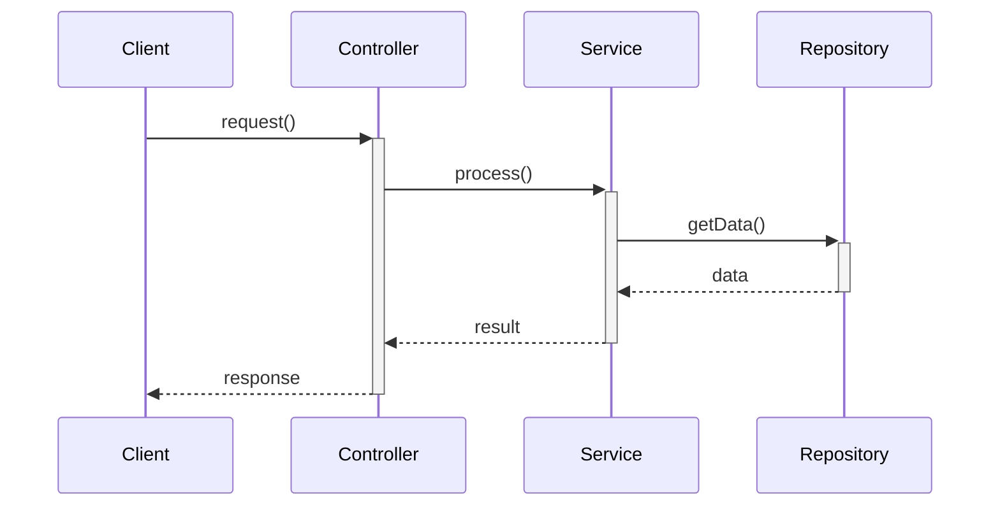
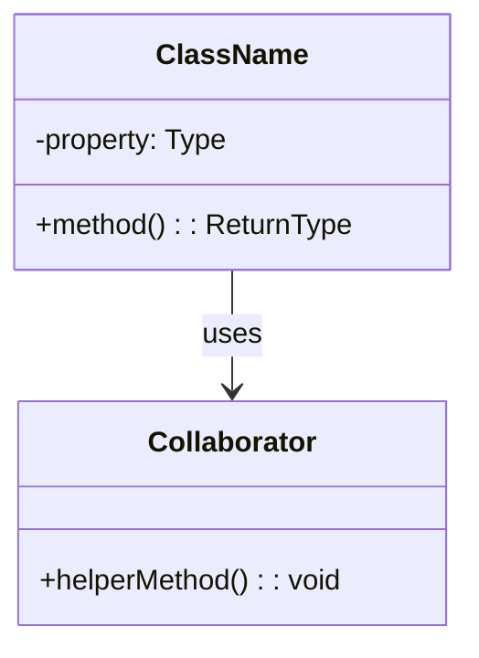
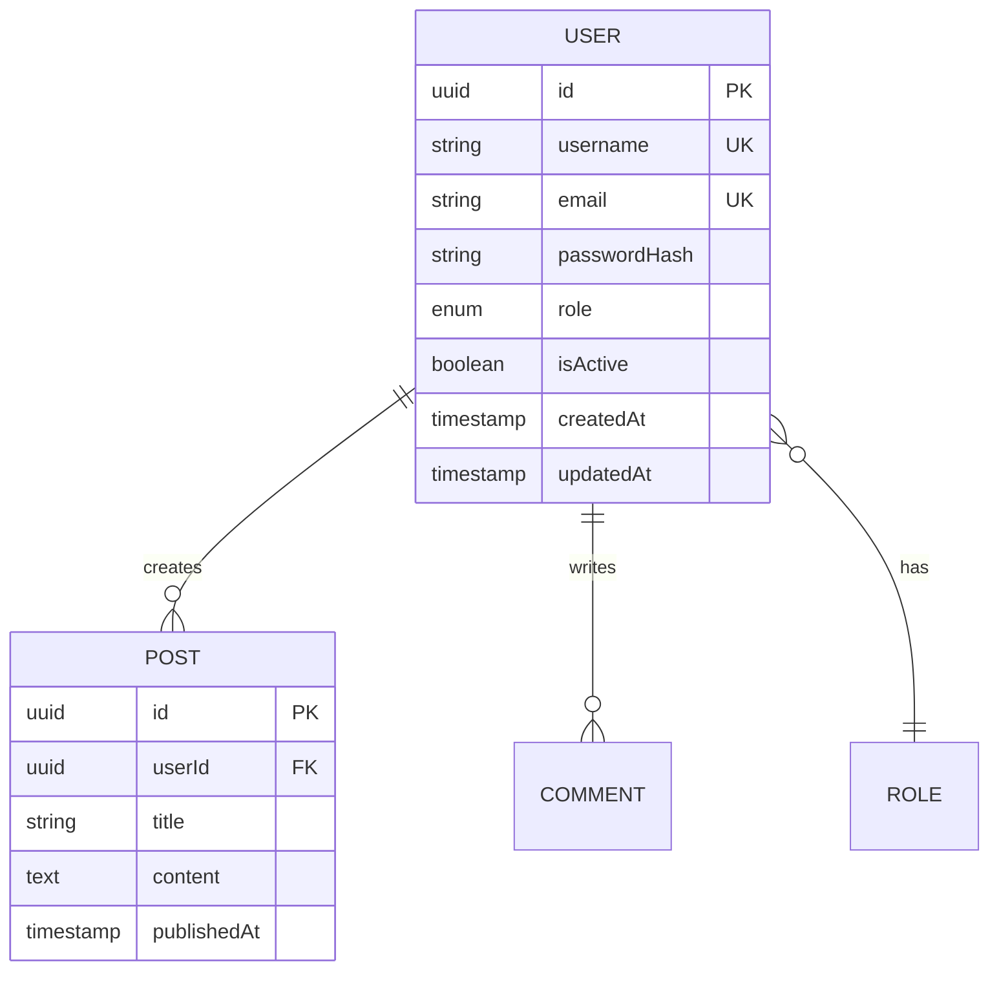

# Phase 04: Detailed Design

**Standards**: IEEE 1016-2009 (Software Design Descriptions)  
**XP Integration**: Simple Design, CRC Cards, Design Patterns  
**DDD Integration**: Entity, Value Object, Aggregate, Repository, Factory, Domain Service, Specification

## 🎯 Phase Objectives

1. Transform architecture into detailed component designs using DDD tactical patterns
2. Define class structures, interfaces, and algorithms with Design by Contract
3. Specify data models and database schemas respecting domain model
4. Document design patterns and implementation approaches
5. Create design specifications enabling implementation

## 📋 Design Documentation Approach

### ⭐ PRIMARY: Link to Architecture Issues (GitHub Issues)

**Design artifacts reference architecture issues** created in Phase 03. Detailed designs can be:
- **GitHub Issue comments** on architecture component issues (ARC-C)
- **Wiki pages** linked from architecture issues
- **Markdown files** in `04-design/` with issue references

#### Linking Design to Architecture Issues

Every design specification MUST reference:
- **Architecture Component Issue**: `#N` (from ARC-C templates)
- **Architecture Decisions**: `#N` (from ADR templates)
- **Requirements**: `#N` (from REQ-F/REQ-NF templates)

**Example Design File Header**:
```markdown
# User Authentication Service - Detailed Design

**Architecture Component**: #79 (ARC-C-AUTH: User Authentication Service)
**Architecture Decisions**:
- #78 (ADR-SECU-001: JWT Authentication)
- #80 (ADR-DATA-001: PostgreSQL for User Data)

**Requirements**:
- #45 (REQ-F-AUTH-001: User Login)
- #46 (REQ-NF-SECU-002: Session Security)

---

## Class Diagram
## Sequence Diagrams
## Data Models
```

#### Comment on Architecture Issues

Add detailed design as comment on architecture component issue:

**Comment on Issue #79 (ARC-C-AUTH)**:
```markdown
## Detailed Design

### Class Structure
\`\`\`typescript
class UserService {
  constructor(
    private userRepository: IUserRepository,
    private jwtService: IJwtService,
    private passwordHasher: IPasswordHasher
  ) {}

  async login(credentials: Credentials): Promise<AuthResult> {
    // Implementation details
  }
}
\`\`\`

### Sequence Diagram
[Mermaid diagram or link to diagram]

### Data Model
[Tables, schemas, relationships]

### Design Patterns
- Repository Pattern for data access
- Dependency Injection for testability
- Strategy Pattern for password hashing algorithms
```

### 📝 Supplementary Design Documentation (Optional)

While **GitHub Issues (ARC-C components) are the single source of truth**, you may create detailed design files in `04-design/` for:
- Detailed class diagrams and UML
- Complex algorithms and pseudocode
- Data structure specifications
- Interface contracts and protocols

**Critical Rule**: All design files MUST reference the architecture component issue(s) using `#N` syntax.

**Example Header for Design File**:
```markdown
# UserService - Detailed Design

**Architecture Component**: #79 (ARC-C-AUTH: User Authentication Service)
**Architecture Decisions**: #78 (ADR-SECU-001: JWT Authentication)
**Requirements**: #45 (REQ-F-AUTH-001), #46 (REQ-NF-SECU-002)

[Design content...]
```

## 📋 IEEE 1016-2009 Compliance

### Software Design Description (SDD) Structure

1. **Design Identification**
2. **Design Stakeholders and Concerns**
3. **Design Views**
   - Logical view
   - Implementation view
   - Dependency view
   - Information/Data view
   - Interface view
   - Interaction view
4. **Design Overlays** (Cross-cutting concerns)
5. **Design Rationale**

## 🎨 XP Practices for This Phase

### Simple Design Principles
1. **Runs all tests** - Design must be testable
2. **Contains no duplication** - DRY principle
3. **Expresses intent** - Self-documenting design
4. **Minimizes classes and methods** - YAGNI

### CRC Cards (Class-Responsibility-Collaboration)
- Define class responsibilities
- Identify collaborators
- Keep designs focused

### Design Patterns
- Use proven patterns
- Don't over-pattern (YAGNI)
- Refactor to patterns when needed

## 📝 Required Deliverables

### 1. Software Design Description (SDD)
**Location**: `software-design-description.md`

```markdown
# Software Design Description

## 1. Design Identification
- **Project Name**: [Name]
- **Version**: [Version]
- **Date**: [Date]
- **Authors**: [Names]

## 2. Design Stakeholders and Concerns

### Developers
**Concerns**: Code organization, testability, maintainability

### Testers
**Concerns**: Test interfaces, mock capabilities, test data

### DevOps
**Concerns**: Deployment units, configuration, monitoring hooks

## 3. Design Views

### 3.1 Logical Design View
#### Component: DES-C-001 [Component Name]

**Trace to Architecture**: ARC-C-001

**Purpose**: [What this component does]

**Responsibilities**:
- [Responsibility 1]
- [Responsibility 2]

**Classes/Modules**:

##### Class: [ClassName]
```typescript
/**
 * [Class description]
 * 
 * Responsibilities:
 * - [Responsibility 1]
 * - [Responsibility 2]
 *
 * Collaborators:
 * - [OtherClass]: [How they collaborate]
 */
class ClassName {
  // Properties
  private property1: Type;
  
  // Constructor
  constructor(dependencies: Dependencies) {
    // Dependency injection
  }
  
  // Public methods
  public method1(param: Type): ReturnType {
    // Method description
  }
  
  // Private methods
  private helperMethod(): void {
    // Helper description
  }
}
```

**Design Patterns Used**:
- [Pattern Name]: [Why and how used]

**Key Algorithms**:
- [Algorithm name]: [Complexity, approach]

### 3.2 Implementation View

**Module Structure**:
```
src/
  ├── components/
  │   ├── ComponentName/
  │   │   ├── index.ts
  │   │   ├── ClassName.ts
  │   │   ├── ClassName.test.ts
  │   │   └── types.ts
```

**File Organization**:
- One class per file
- Tests co-located with code
- Shared types in separate files

### 3.3 Dependency View

**Component Dependencies**:
```
DES-C-001 (ComponentName)
  ↓ depends on
DES-C-002 (DataAccess)
DES-C-003 (Logger)
```

**Dependency Injection**:
- Use constructor injection
- Dependencies passed as interfaces
- Enable mocking for tests

### 3.4 Data/Information View

**Data Models**: See `data-models/`

**Caching Strategy**:
- [What is cached]
- [Cache invalidation approach]

**Data Flow**:
```
User Request
  → Controller
  → Service Layer
  → Repository
  → Database
```

### 3.5 Interface View

**Public Interfaces**: See `interfaces/`

**API Contracts**:
- REST endpoints
- GraphQL schemas
- Message contracts

### 3.6 Interaction View

**Sequence Diagrams**:


## 4. Design Overlays (Cross-cutting Concerns)

### 4.1 Error Handling Design
```typescript
// Error hierarchy
class AppError extends Error {
  constructor(
    message: string,
    public code: string,
    public statusCode: number
  ) {}
}

class ValidationError extends AppError {
  constructor(message: string) {
    super(message, 'VALIDATION_ERROR', 400);
  }
}

class NotFoundError extends AppError {
  constructor(resource: string) {
    super(`${resource} not found`, 'NOT_FOUND', 404);
  }
}
```

### 4.2 Logging Design
```typescript
interface ILogger {
  debug(message: string, context?: object): void;
  info(message: string, context?: object): void;
  warn(message: string, context?: object): void;
  error(message: string, error: Error, context?: object): void;
}
```

### 4.3 Security Design
- Authentication: JWT tokens
- Authorization: Role-based access control (RBAC)
- Input validation: All inputs sanitized
- Output encoding: XSS prevention

### 4.4 Transaction Management
```typescript
interface IUnitOfWork {
  beginTransaction(): Promise<void>;
  commit(): Promise<void>;
  rollback(): Promise<void>;
}
```

## 5. Design Rationale

### Key Design Decisions

#### DES-DEC-001: Use Repository Pattern
**Rationale**: Separates data access logic from business logic, enables easy testing

**Alternatives Considered**: Active Record
**Why This Approach**: Better testability (XP requirement), loose coupling

#### DES-DEC-002: Dependency Injection via Constructor
**Rationale**: Makes dependencies explicit, enables testing with mocks

#### DES-DEC-003: Immutable Data Structures
**Rationale**: Thread safety, easier debugging, functional programming benefits

## 6. Traceability

| Design Element | Architecture | Requirements |
|---------------|-------------|--------------|
| DES-C-001     | ARC-C-001   | REQ-F-001    |

## 7. Testing Strategy

### Unit Testing
- Test each class in isolation
- Mock all dependencies
- TDD approach (write tests first)
- Target: >80% code coverage

### Integration Testing
- Test component interactions
- Use test doubles for external systems
- Test error scenarios

## 8. Implementation Notes

### Coding Standards
- Follow [language] style guide
- Use linting tools
- Code review required

### Performance Considerations
- [Optimization approach]
- [Caching strategy]
- [Algorithm complexity]
```

### 2. Component Design Documents
**Location**: `components/[component-name]-design.md`

```markdown
# Component Design: [Component Name]

**ID**: DES-C-001  
**Trace to**: ARC-C-001, REQ-F-XXX

## Purpose
[What this component does]

## Responsibilities
- [Responsibility 1]
- [Responsibility 2]

## CRC Card

### Class: [ClassName]
**Responsibilities**:
- [Responsibility]

**Collaborators**:
- [Class]: [For what purpose]

## Class Diagram


## Detailed Class Specifications

### Class: ClassName

#### Properties
```typescript
private userId: string;           // Unique user identifier
private createdAt: Date;          // Timestamp of creation
private status: UserStatus;       // Active, Suspended, Deleted
```

#### Methods

##### public method1(param: Type): ReturnType
**Purpose**: [What it does]

**Preconditions**:
- [Condition that must be true before calling]

**Postconditions**:
- [What will be true after successful execution]

**Algorithm**:
```
1. Validate input parameters
2. Perform business logic
3. Update state
4. Return result
```

**Error Conditions**:
- `ValidationError` - If param is invalid
- `NotFoundException` - If resource not found

**Complexity**: O(n log n)

**Test Strategy**:
- Test with valid inputs
- Test with invalid inputs
- Test error conditions
- Test edge cases

#### Example Usage
```typescript
// Create instance
const instance = new ClassName(dependencies);

// Use method
const result = instance.method1(validInput);
```

## Design Patterns

### Pattern: Repository Pattern
**Intent**: Abstract data access layer

**Participants**:
- Repository interface
- Concrete repository
- Data models

**Implementation**:
```typescript
interface IUserRepository {
  findById(id: string): Promise<User | null>;
  save(user: User): Promise<User>;
  delete(id: string): Promise<void>;
}

class UserRepository implements IUserRepository {
  constructor(private db: IDatabase) {}
  
  async findById(id: string): Promise<User | null> {
    // Implementation
  }
}
```

## Dependencies
- [Dependency 1]: [Purpose]
- [Dependency 2]: [Purpose]

## Testing Approach

### Unit Tests
```typescript
describe('ClassName', () => {
  let sut: ClassName;
  let mockDependency: jest.Mocked<IDependency>;
  
  beforeEach(() => {
    mockDependency = createMockDependency();
    sut = new ClassName(mockDependency);
  });
  
  it('should do something correctly', () => {
    // Arrange
    const input = createTestInput();
    
    // Act
    const result = sut.method1(input);
    
    // Assert
    expect(result).toEqual(expectedOutput);
  });
});
```

## Performance Considerations
- [Caching strategy]
- [Algorithm complexity]
- [Resource usage]

## Security Considerations
- [Input validation]
- [Authorization checks]
- [Data protection]
```

### 3. Data Model Specifications
**Location**: `data-models/data-model-specification.md`

```markdown
# Data Model Specification

## Entities

### Entity: User

**Trace to**: REQ-F-XXX

#### Attributes
| Attribute | Type | Constraints | Description |
|-----------|------|-------------|-------------|
| id | UUID | Primary Key, Not Null | Unique identifier |
| username | String(50) | Unique, Not Null | User login name |
| email | String(255) | Unique, Not Null | Email address |
| passwordHash | String(255) | Not Null | Hashed password |
| role | Enum | Not Null | USER, ADMIN, MODERATOR |
| isActive | Boolean | Default: true | Account status |
| createdAt | Timestamp | Not Null | Creation timestamp |
| updatedAt | Timestamp | Not Null | Last update timestamp |

#### Business Rules
- Username must be 3-50 characters
- Email must be valid format
- Password must be hashed (bcrypt, 10 rounds)
- Soft delete via isActive flag

#### Relationships
- One User has many Posts (1:N)
- One User has many Comments (1:N)
- One User belongs to one Role (N:1)

### Entity Relationship Diagram


## Database Schema

### Table: users
```sql
CREATE TABLE users (
    id UUID PRIMARY KEY DEFAULT gen_random_uuid(),
    username VARCHAR(50) NOT NULL UNIQUE,
    email VARCHAR(255) NOT NULL UNIQUE,
    password_hash VARCHAR(255) NOT NULL,
    role VARCHAR(20) NOT NULL DEFAULT 'USER',
    is_active BOOLEAN NOT NULL DEFAULT true,
    created_at TIMESTAMP NOT NULL DEFAULT CURRENT_TIMESTAMP,
    updated_at TIMESTAMP NOT NULL DEFAULT CURRENT_TIMESTAMP,
    
    CONSTRAINT chk_role CHECK (role IN ('USER', 'ADMIN', 'MODERATOR')),
    CONSTRAINT chk_username_length CHECK (length(username) >= 3)
);

CREATE INDEX idx_users_email ON users(email);
CREATE INDEX idx_users_username ON users(username);
CREATE INDEX idx_users_role ON users(role);
```

### Indexes
- Primary key index on `id`
- Unique index on `username`
- Unique index on `email`
- Index on `role` (for filtering)

## Object-Relational Mapping

### TypeScript Model
```typescript
import { Entity, Column, PrimaryGeneratedColumn, CreateDateColumn, UpdateDateColumn } from 'typeorm';

@Entity('users')
export class User {
  @PrimaryGeneratedColumn('uuid')
  id: string;
  
  @Column({ type: 'varchar', length: 50, unique: true })
  username: string;
  
  @Column({ type: 'varchar', length: 255, unique: true })
  email: string;
  
  @Column({ name: 'password_hash', type: 'varchar', length: 255 })
  passwordHash: string;
  
  @Column({ type: 'varchar', length: 20, default: 'USER' })
  role: UserRole;
  
  @Column({ name: 'is_active', type: 'boolean', default: true })
  isActive: boolean;
  
  @CreateDateColumn({ name: 'created_at' })
  createdAt: Date;
  
  @UpdateDateColumn({ name: 'updated_at' })
  updatedAt: Date;
}

export enum UserRole {
  USER = 'USER',
  ADMIN = 'ADMIN',
  MODERATOR = 'MODERATOR'
}
```

## Data Validation

### Input Validation
```typescript
class CreateUserDto {
  @IsString()
  @Length(3, 50)
  username: string;
  
  @IsEmail()
  email: string;
  
  @IsString()
  @MinLength(8)
  @Matches(/^(?=.*[a-z])(?=.*[A-Z])(?=.*\d)/, {
    message: 'Password must contain uppercase, lowercase, and number'
  })
  password: string;
  
  @IsEnum(UserRole)
  role: UserRole;
}
```

## Migration Strategy

### Initial Migration
```sql
-- V001_create_users_table.sql
-- Add table creation SQL
```

### Data Migration
- Export existing data
- Transform to new schema
- Import with validation
- Verify data integrity
```

### 4. Interface Design Documents
**Location**: `interfaces/api-design.md`

```markdown
# API Interface Design

## REST API Endpoints

### Endpoint: POST /api/v1/users
**Purpose**: Create new user

**Request**:
```json
{
  "username": "string (3-50 chars)",
  "email": "string (valid email)",
  "password": "string (min 8 chars)",
  "role": "USER | ADMIN | MODERATOR"
}
```

**Response 201 Created**:
```json
{
  "id": "uuid",
  "username": "string",
  "email": "string",
  "role": "string",
  "createdAt": "ISO 8601 timestamp"
}
```

**Error Responses**:
- `400 Bad Request` - Invalid input
  ```json
  {
    "error": "VALIDATION_ERROR",
    "message": "Username must be 3-50 characters",
    "field": "username"
  }
  ```
- `409 Conflict` - Username/email already exists
- `500 Internal Server Error` - Server error

**Authentication**: Not required (registration endpoint)

**Rate Limiting**: 10 requests per hour per IP

### Endpoint: GET /api/v1/users/:id
[Similar detailed specification]

## GraphQL Schema

```graphql
type User {
  id: ID!
  username: String!
  email: String!
  role: UserRole!
  isActive: Boolean!
  createdAt: DateTime!
  posts: [Post!]!
}

enum UserRole {
  USER
  ADMIN
  MODERATOR
}

type Query {
  user(id: ID!): User
  users(filter: UserFilter, page: Int, limit: Int): UserPage!
}

type Mutation {
  createUser(input: CreateUserInput!): User!
  updateUser(id: ID!, input: UpdateUserInput!): User!
  deleteUser(id: ID!): Boolean!
}

input CreateUserInput {
  username: String!
  email: String!
  password: String!
  role: UserRole!
}
```
```

## 🏛️ DDD Tactical Patterns Integration

### When Designing Domain Layer Components

Use DDD tactical patterns for domain-rich contexts (see `04-design/patterns/ddd-tactical-patterns.md`):

**Entity** - Objects with identity and continuity
- Use when: Object has unique identifier and lifecycle
- Example: User, Order, Account
- Must have: ID (as Value Object), domain behavior methods, invariant enforcement

**Value Object** - Immutable objects defined by attributes
- Use when: Only attributes matter, not identity
- Example: Email, Money, Address
- Must be: Immutable, side-effect-free functions, equals based on attributes

**Aggregate** - Consistency boundary with one root Entity
- Use when: Multiple objects need transactional consistency
- Example: Order (root) + OrderLines (internal)
- Rules: External references by ID only, one transaction = one Aggregate, root enforces invariants

**Repository** - Collection-like interface for Aggregate Roots
- Use when: Need to abstract persistence for Aggregate Root
- Interface in Domain Layer, implementation in Infrastructure Layer
- Example: IOrderRepository.findById(orderId)

**Factory** - Encapsulates complex object creation
- Use when: Construction logic is complex or requires validation
- Example: OrderFactory.createFromCart(customerId, cart)

**Domain Service** - Stateless operations spanning Entities/Aggregates
- Use when: Operation doesn't fit on Entity or Value Object
- Example: TransferMoneyService.transfer(fromAccount, toAccount, amount)

**Specification** - Explicit predicate for business rules
- Use when: Complex validation or selection criteria
- Example: OverdueInvoiceSpecification.isSatisfiedBy(invoice)

### Design by Contract (DbC)

Apply DbC principles to all public methods (see `04-design/patterns/design-by-contract.md`):

**Preconditions** - What must be true before method executes
- Document using JSDoc `@precondition` tags
- Validate at method entry (assertions or exceptions)
- Example: `@precondition amount > 0`

**Postconditions** - What will be true after method executes
- Document using JSDoc `@postcondition` tags
- Verify before method returns
- Example: `@postcondition balance === old(balance) - amount`

**Invariants** - What must always be true for object
- Check before and after every public method
- Document in class-level comment
- Example: `@invariant balance >= -overdraftLimit`

### Domain Model Design Checklist

For each class, determine:
- [ ] Is this an Entity (has identity) or Value Object (attributes only)?
- [ ] What is the Aggregate boundary (if applicable)?
- [ ] What invariants must be maintained?
- [ ] What are the preconditions and postconditions for each method?
- [ ] Where does this fit in Layered Architecture (Domain vs Infrastructure)?
- [ ] Does this need a Repository? (Only for Aggregate Roots)
- [ ] Is a Factory needed for complex creation?
- [ ] Should this be a Domain Service? (Stateless, spans multiple objects)

## 🚨 Critical Requirements for This Phase

### Always Do
✅ Follow Simple Design principles: runs all tests, no duplication, expresses intent, minimizes elements  
✅ Design for testability (TDD-ready)  
✅ Apply DDD patterns appropriately in domain-rich contexts  
✅ Document contracts (preconditions, postconditions, invariants)  
✅ Document all public interfaces  
✅ Trace design to architecture and requirements  
✅ Use design patterns appropriately (but let them emerge naturally)  
✅ Specify error handling  
✅ Define data validation rules  
✅ Include algorithm complexity analysis  
✅ Implement simplest design that could possibly work  
✅ Eliminate duplication (DRY: Don't Repeat Yourself - single authoritative representation)  
✅ Follow Open-Closed Principle (open for extension, closed for modification)  
✅ Follow Single Responsibility Principle (one reason to change)  
✅ Favor composition over inheritance  
✅ Program to interfaces, not implementations  
✅ Depend on abstractions (Dependency Inversion Principle)  
✅ Encapsulate what varies  
✅ Use side-effect-free functions where possible (especially in Value Objects)  
✅ Refactor continuously to improve design  
✅ Strive for loose coupling and high cohesion  
✅ Keep Aggregates small (2-3 entities max)  
✅ Isolate Domain Layer from infrastructure concerns  

### Never Do
❌ Over-engineer (YAGNI)  
❌ Create designs that can't be tested  
❌ Skip error handling design  
❌ Ignore performance considerations  
❌ Create circular dependencies  
❌ Design without considering refactoring  
❌ Skip documentation of design decisions  
❌ Duplicate logic (violate DRY)  
❌ Create train wrecks (chain method calls, more than one ".")  
❌ Add flexibility or abstraction without demonstrable need today  
❌ Force design patterns just for the sake of using them  
❌ Instantiate dependencies directly inside class (Control Freak anti-pattern)  
❌ Use Service Locator anti-pattern  
❌ Use global data or Singletons as global variables  
❌ Create two elements with identical/similar responsibilities  
❌ Design entire system before implementation  
❌ Expose Aggregate internals (always access through root)  
❌ Create Repositories for non-root Entities  
❌ Make Value Objects mutable (always immutable)  
❌ Skip invariant enforcement in Aggregates  
❌ Allow Entity equality based on attributes (must use ID)  
❌ Put domain logic in Infrastructure Layer (keep in Domain Layer)  

## 📊 Phase Entry Criteria

✅ Architecture Description approved  
✅ Component boundaries defined  
✅ Technical constraints documented  

## 📊 Phase Exit Criteria

✅ Software Design Description (SDD) complete per IEEE 1016  
✅ All components have detailed design specs  
✅ Data models fully specified  
✅ Interface contracts defined  
✅ Design patterns documented  
✅ Traceability to architecture established  
✅ Design reviewed and approved  
✅ Design supports TDD approach  

## 🔗 Traceability

```
ARC-C-XXX (Architecture Component)
  ↓
DES-C-XXX (Design Component)
DES-CL-XXX (Design Class)
  ↓
[Next Phase: Implementation - CODE-XXX]
```

## 🔗 DDD and DbC Resources

### Core Documentation
- **DDD Tactical Patterns**: `04-design/patterns/ddd-tactical-patterns.md` - Complete guide with code examples
- **Design by Contract**: `04-design/patterns/design-by-contract.md` - Preconditions, postconditions, invariants
- **Ubiquitous Language**: `02-requirements/ubiquitous-language.md` - Domain terminology glossary
- **Context Map**: `03-architecture/context-map.md` - Bounded Context relationships

### Quick Reference
- Entity: Identity-based, mutable, lifecycle
- Value Object: Attribute-based, immutable, side-effect-free
- Aggregate: Consistency boundary, one root, transactional unit
- Repository: Aggregate Root access, Domain interface, Infrastructure implementation
- Factory: Complex creation logic, validation
- Domain Service: Stateless, spans multiple objects
- Specification: Explicit business rules, composable

## 🎯 Next Phase

Once this phase is complete, proceed to:
**Phase 05: Implementation** (`05-implementation/`)

---

**Remember**: Design bridges architecture and code. Keep it simple (XP), make it testable (TDD), apply DDD patterns in domain-rich contexts, and document contracts. Good design enables smooth implementation!
