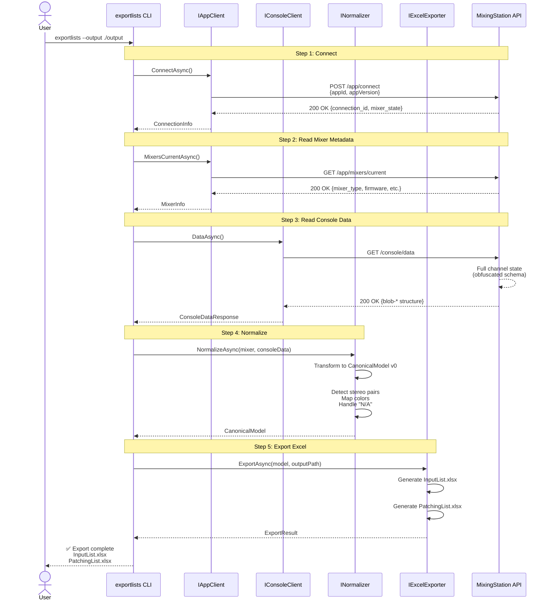

# Phase 1 Detailed Design: Connect → Read → Normalize → Export

**Status**: Draft  
**Date**: 2026-01-30  
**Author**: Standards Compliance Advisor  
**Phase**: 04 - Detailed Design  
**Scope**: Epic 1 - Ingest & Normalize (Vertical Slice)

## Traceability

**Stakeholder Requirements**:
- #1 (StR-001: Epic 1 - Ingest & Normalize)

**Functional Requirements**:
- #4 (REQ-F-001: HTTP Client Transport)
- #5 (REQ-F-002: Application State Reading)
- #6 (REQ-F-003: Console Data Reading)
- #7 (REQ-F-004: Data Normalization)
- #8 (REQ-F-005: Excel Export)
- #9 (REQ-F-006: CLI Tool)

**Architecture Decisions**:
- #10 (ADR-001: .NET 8 Runtime)
- #11 (ADR-002: HTTP Transport + REST Mirror Naming)
- #12 (ADR-003: CanonicalModel v0)
- #13 (ADR-004: Excel Export Library)

---

## 1. Design Overview

### 1.1 Purpose
This document specifies the detailed design for Phase 1 (Epic 1): a vertical slice implementing the complete pipeline from MixingStation connection to Excel export.

**Success Criteria** (from StR-001):
- CLI tool `exportlists` connects to MixingStation at http://localhost:8045
- Reads mixer metadata (/app/*) and console data (/console/*)
- Normalizes into CanonicalModel v0
- Exports `InputList.xlsx` and `PatchingList.xlsx`

### 1.2 Scope Boundaries

**In Scope** (Phase 1):
- HTTP transport layer (connect, auth placeholder, error handling)
- App state endpoints: `/app/connect`, `/app/mixers/current`
- Console endpoints: `/console/data` (full read)
- CanonicalModel v0 transformation
- Excel export (2 sheets: InputList, PatchingList)
- CLI example (`exportlists`)

**Out of Scope** (Future Phases):
- WebSocket subscription (`/console/data/subscribe`)
- Value get/set (`/con/*`)
- Patch upload (`/console/data` POST)
- Advanced venue automation
- Full-featured CLI with interactive modes

---

## 2. System Sequence Diagram



**Key Flows**:
1. **Connect**: Establish session with MixingStation
2. **Read Metadata**: Get mixer type, firmware, capabilities
3. **Read Console**: Full channel state (names, patches, colors)
4. **Normalize**: Transform obfuscated API response → CanonicalModel v0
5. **Export**: Generate Excel files with proper formatting

---

## 3. Public API Mapping (REST Mirror Naming Policy)

Per **ADR-002** (issue #11), all public client methods MUST mirror REST endpoints exactly.

### 3.1 Naming Derivation Algorithm

**Formula**: `/{group}/{segment1}[/{segment2}]` + HTTP verb → `{Verb}{Segment1}[Segment2]Async()`

**Exception**: Single-verb endpoints (no segment) → `{Verb}Async()`

### 3.2 Phase 1 Endpoint Mapping

| REST Endpoint | HTTP Method | Derived Method Name | Interface | Implements Req |
|---------------|-------------|---------------------|-----------|----------------|
| `/app/connect` | POST | `ConnectAsync(AppConnectRequest)` | IAppClient | #4 REQ-F-001 |
| `/app/mixers/current` | GET | `MixersCurrentAsync()` | IAppClient | #5 REQ-F-002 |
| `/console/data` | GET | `DataAsync()` | IConsoleClient | #6 REQ-F-003 |

**CI Enforcement**: `scripts/validate-api-naming.py` validates compiled assembly against OpenAPI spec.

### 3.3 Interface Contracts

#### IAppClient (namespace: MixingStation.Client.App)

```csharp
using System.Threading;
using System.Threading.Tasks;
using MixingStation.Client.Models;

namespace MixingStation.Client.App
{
    /// <summary>
    /// REST client for /app/* endpoints (application lifecycle).
    /// Public API mirrors REST endpoints exactly (ADR-002).
    /// </summary>
    public interface IAppClient
    {
        /// <summary>
        /// POST /app/connect - Establish session with MixingStation.
        /// </summary>
        /// <param name="request">Connection parameters (appId, appVersion).</param>
        /// <param name="cancellationToken">Cancellation token.</param>
        /// <returns>Connection info (session ID, mixer state).</returns>
        Task<AppConnectResponse> ConnectAsync(
            AppConnectRequest request, 
            CancellationToken cancellationToken = default);

        /// <summary>
        /// GET /app/mixers/current - Get current mixer metadata.
        /// </summary>
        /// <param name="cancellationToken">Cancellation token.</param>
        /// <returns>Mixer info (type, firmware, capabilities).</returns>
        Task<AppMixersCurrentResponse> MixersCurrentAsync(
            CancellationToken cancellationToken = default);
    }
}
```

#### IConsoleClient (namespace: MixingStation.Client.Console)

```csharp
using System.Threading;
using System.Threading.Tasks;
using MixingStation.Client.Models;

namespace MixingStation.Client.Console
{
    /// <summary>
    /// REST client for /console/* endpoints (console state).
    /// Public API mirrors REST endpoints exactly (ADR-002).
    /// </summary>
    public interface IConsoleClient
    {
        /// <summary>
        /// GET /console/data - Read full console state (all channels).
        /// </summary>
        /// <param name="cancellationToken">Cancellation token.</param>
        /// <returns>Console data (obfuscated blob-* schema).</returns>
        Task<ConsoleDataResponse> DataAsync(
            CancellationToken cancellationToken = default);
    }
}
```

#### INormalizer (namespace: MixingStation.Client.Normalization)

```csharp
using System.Threading.Tasks;
using MixingStation.Client.Models;

namespace MixingStation.Client.Normalization
{
    /// <summary>
    /// Transforms API responses into CanonicalModel v0 (ADR-003).
    /// NOT a REST client - internal transformation logic.
    /// </summary>
    public interface INormalizer
    {
        /// <summary>
        /// Normalize mixer metadata + console data into CanonicalModel v0.
        /// </summary>
        /// <param name="mixerInfo">Mixer metadata from /app/mixers/current.</param>
        /// <param name="consoleData">Console state from /console/data.</param>
        /// <returns>Normalized canonical model.</returns>
        Task<CanonicalModel> NormalizeAsync(
            AppMixersCurrentResponse mixerInfo, 
            ConsoleDataResponse consoleData);
    }
}
```

#### IExcelExporter (namespace: MixingStation.Client.Export)

```csharp
using System.Threading.Tasks;
using MixingStation.Client.Models;

namespace MixingStation.Client.Export
{
    /// <summary>
    /// Exports CanonicalModel to Excel files (ADR-004).
    /// NOT a REST client - internal export logic.
    /// </summary>
    public interface IExcelExporter
    {
        /// <summary>
        /// Export CanonicalModel to InputList.xlsx and PatchingList.xlsx.
        /// </summary>
        /// <param name="model">Canonical model to export.</param>
        /// <param name="outputDirectory">Output directory path.</param>
        /// <returns>Export result (file paths, success/failure).</returns>
        Task<ExportResult> ExportAsync(
            CanonicalModel model, 
            string outputDirectory);
    }
}
```

---

## 4. CanonicalModel v0 Mapping Table

Per **ADR-003** (issue #12), CanonicalModel v0 defines the normalized data structure.

### 4.1 Data Model Structure

```csharp
namespace MixingStation.Client.Models
{
    /// <summary>
    /// CanonicalModel v0 - Normalized representation of console state.
    /// </summary>
    public class CanonicalModel
    {
        public MixerInfo Mixer { get; set; }
        public List<ChannelInfo> Channels { get; set; }
        public List<PatchInfo> Patches { get; set; }
    }

    public class MixerInfo
    {
        public string Type { get; set; }          // e.g., "X32", "M32", "Wing"
        public string Firmware { get; set; }      // e.g., "4.08"
        public int InputCount { get; set; }       // Physical inputs
        public int OutputCount { get; set; }      // Physical outputs
    }

    public class ChannelInfo
    {
        public int ChannelNumber { get; set; }    // 1-based
        public string Name { get; set; }          // User-defined name
        public string Color { get; set; }         // Hex color or "N/A"
        public bool IsStereo { get; set; }        // Stereo pair flag
        public int? StereoPairWith { get; set; }  // Linked channel (if stereo)
    }

    public class PatchInfo
    {
        public int ChannelNumber { get; set; }    // 1-based
        public string PatchSource { get; set; }   // e.g., "Local 1", "AES50-A 1"
        public string PatchType { get; set; }     // "Local", "AES50-A", "AES50-B", etc.
    }
}
```

### 4.2 API → CanonicalModel Mapping

| API Response Field | CanonicalModel Field | Transformation Logic |
|--------------------|----------------------|----------------------|
| `/app/mixers/current` → `mixer_type` | `MixerInfo.Type` | Direct copy |
| `/app/mixers/current` → `firmware` | `MixerInfo.Firmware` | Direct copy |
| `/console/data` → `blob-*` (obfuscated) | `ChannelInfo.Name` | Parse obfuscated schema → extract names |
| `/console/data` → color codes | `ChannelInfo.Color` | Map integer → hex color (OFF → "N/A") |
| `/console/data` → stereo flags | `ChannelInfo.IsStereo` | Detect consecutive channels with link flag |
| `/console/data` → patch routing | `PatchInfo.PatchSource` | Parse routing table → friendly names |

**Normalization Rules** (per ADR-003):
1. **Color Mapping**: API color integers → hex codes (e.g., `0 → "#FF0000" (Red)`, `OFF → "N/A"`)
2. **Stereo Pair Detection**: Channels with `stereo_link = true` → set `IsStereo = true`, link to adjacent channel
3. **"N/A" Handling**: Unset values (color off, no patch) → explicit `"N/A"` string
4. **Channel Numbering**: API uses 0-based index; CanonicalModel uses 1-based (user-friendly)

---

## 5. Component Algorithms

### 5.1 Stereo Pair Detection

**Algorithm** (Normalizer):
```
For each channel in console data:
  If channel.stereo_link == true:
    current.IsStereo = true
    If index is even:
      current.StereoPairWith = index + 2  // Next channel (1-based)
      next.IsStereo = true
      next.StereoPairWith = index + 1     // Current channel
```

**Complexity**: O(n) where n = channel count

### 5.2 Color Code Mapping

**Algorithm** (Normalizer):
```
ColorMap = {
  0: "OFF" → "N/A",
  1: "#FF0000" (Red),
  2: "#00FF00" (Green),
  3: "#0000FF" (Blue),
  // ... (full mapping in ADR-003)
}

For each channel:
  colorInt = channel.color_code
  If colorInt in ColorMap:
    channel.Color = ColorMap[colorInt]
  Else:
    channel.Color = "N/A"  // Unknown codes default to N/A
```

### 5.3 Patch Source Formatting

**Algorithm** (Normalizer):
```
For each channel patch:
  patchCode = channel.patch_source  // e.g., "AES50A_01"
  If patchCode starts with "LOCAL":
    PatchInfo.PatchType = "Local"
    PatchInfo.PatchSource = "Local " + extractNumber(patchCode)
  Else if patchCode starts with "AES50":
    PatchInfo.PatchType = extractBus(patchCode)  // "AES50-A" or "AES50-B"
    PatchInfo.PatchSource = PatchInfo.PatchType + " " + extractNumber(patchCode)
  Else:
    PatchInfo.PatchSource = patchCode  // Fallback: raw code
```

---

## 6. Error Handling Design

### 6.1 Exception Hierarchy

```csharp
namespace MixingStation.Client.Exceptions
{
    /// <summary>
    /// Base exception for all MixingStation client errors.
    /// </summary>
    public class MixingStationException : Exception
    {
        public MixingStationException(string message) : base(message) { }
        public MixingStationException(string message, Exception inner) : base(message, inner) { }
    }

    /// <summary>
    /// HTTP transport errors (network, timeout, 4xx/5xx).
    /// </summary>
    public class TransportException : MixingStationException
    {
        public int? StatusCode { get; }
        public TransportException(string message, int? statusCode = null) : base(message)
        {
            StatusCode = statusCode;
        }
    }

    /// <summary>
    /// Data normalization errors (invalid format, missing fields).
    /// </summary>
    public class NormalizationException : MixingStationException
    {
        public NormalizationException(string message) : base(message) { }
        public NormalizationException(string message, Exception inner) : base(message, inner) { }
    }

    /// <summary>
    /// Excel export errors (file I/O, invalid path, EPPlus errors).
    /// </summary>
    public class ExportException : MixingStationException
    {
        public ExportException(string message) : base(message) { }
        public ExportException(string message, Exception inner) : base(message, inner) { }
    }
}
```

### 6.2 Error Recovery Strategy

| Error Condition | Recovery Approach | User Experience |
|-----------------|-------------------|-----------------|
| HTTP 4xx (Client Error) | Fail fast, log details | Clear error message with fix suggestion |
| HTTP 5xx (Server Error) | Retry 3x with exp backoff | Progress indicator, eventual failure message |
| Network timeout | Retry 3x, then fail | "MixingStation unreachable" message |
| Invalid JSON response | Fail fast, log raw response | "API response invalid" + debug logs |
| Normalization failure | Skip invalid channels, log warnings | "Partial export with warnings" |
| Excel I/O error | Fail fast, suggest path fix | "Cannot write to path: ..." |

---

## 7. Test Plan (Phase 1)

### 7.1 Unit Tests (Target: 70-80% coverage)

#### IAppClient Tests
- ✅ `ConnectAsync_ValidRequest_ReturnsConnectionInfo`
- ✅ `ConnectAsync_NetworkError_ThrowsTransportException`
- ✅ `ConnectAsync_InvalidResponse_ThrowsNormalizationException`
- ✅ `MixersCurrentAsync_Success_ReturnsMixerInfo`
- ✅ `MixersCurrentAsync_404NotFound_ThrowsTransportException`

#### IConsoleClient Tests
- ✅ `DataAsync_Success_ReturnsConsoleData`
- ✅ `DataAsync_ObfuscatedSchema_ParsesCorrectly`
- ✅ `DataAsync_Timeout_ThrowsTransportException`

#### INormalizer Tests
- ✅ `NormalizeAsync_ValidData_ReturnsCanonicalModel`
- ✅ `NormalizeAsync_StereoPairs_DetectsCorrectly`
- ✅ `NormalizeAsync_ColorMapping_MapsAllKnownCodes`
- ✅ `NormalizeAsync_ColorOff_ReturnsNA`
- ✅ `NormalizeAsync_MissingFields_ThrowsNormalizationException`
- ✅ `NormalizeAsync_PatchSources_FormatsCorrectly`

#### IExcelExporter Tests
- ✅ `ExportAsync_ValidModel_CreatesInputList`
- ✅ `ExportAsync_ValidModel_CreatesPatchingList`
- ✅ `ExportAsync_InvalidPath_ThrowsExportException`
- ✅ `ExportAsync_ModelWithStereo_FormatsCorrectly`
- ✅ `ExportAsync_ModelWithNA_HandlesGracefully`

### 7.2 Integration Tests

#### End-to-End Pipeline Test
```csharp
[Fact]
public async Task EndToEnd_ConnectReadNormalizeExport_Success()
{
    // Arrange
    var appClient = _serviceProvider.GetRequiredService<IAppClient>();
    var consoleClient = _serviceProvider.GetRequiredService<IConsoleClient>();
    var normalizer = _serviceProvider.GetRequiredService<INormalizer>();
    var exporter = _serviceProvider.GetRequiredService<IExcelExporter>();
    
    // Act - Connect
    var connectionInfo = await appClient.ConnectAsync(new AppConnectRequest
    {
        AppId = "test-client",
        AppVersion = "1.0.0"
    });
    Assert.NotNull(connectionInfo.ConnectionId);
    
    // Act - Read Mixer
    var mixerInfo = await appClient.MixersCurrentAsync();
    Assert.NotNull(mixerInfo.Type);
    
    // Act - Read Console
    var consoleData = await consoleClient.DataAsync();
    Assert.NotEmpty(consoleData.Channels);
    
    // Act - Normalize
    var model = await normalizer.NormalizeAsync(mixerInfo, consoleData);
    Assert.NotEmpty(model.Channels);
    Assert.NotEmpty(model.Patches);
    
    // Act - Export
    var result = await exporter.ExportAsync(model, "./test-output");
    
    // Assert
    Assert.True(File.Exists("./test-output/InputList.xlsx"));
    Assert.True(File.Exists("./test-output/PatchingList.xlsx"));
}
```

#### Mock API Tests
- Use WireMock or similar to simulate MixingStation API
- Test error conditions (404, 500, timeout)
- Test edge cases (empty channel list, all colors off)

### 7.3 Acceptance Tests

**Scenario 1**: Export from X32 console
- Given: MixingStation running on X32 at localhost:8045
- When: `exportlists --output ./output`
- Then: InputList.xlsx contains 32 channels with names/colors
- And: PatchingList.xlsx contains patch routing

**Scenario 2**: Export from Wing console
- Given: MixingStation running on Wing at localhost:8045
- When: `exportlists --output ./output`
- Then: InputList.xlsx contains 48 channels
- And: Stereo pairs correctly detected

**Scenario 3**: Offline export (mock API)
- Given: Mock API with test data
- When: `exportlists --api http://localhost:9999 --output ./output`
- Then: Export succeeds with test data

### 7.4 Test Traceability

| Test Case | Verifies Requirement | Implements Design |
|-----------|----------------------|-------------------|
| `ConnectAsync_ValidRequest_ReturnsConnectionInfo` | #4 REQ-F-001 | IAppClient.ConnectAsync |
| `MixersCurrentAsync_Success_ReturnsMixerInfo` | #5 REQ-F-002 | IAppClient.MixersCurrentAsync |
| `DataAsync_Success_ReturnsConsoleData` | #6 REQ-F-003 | IConsoleClient.DataAsync |
| `NormalizeAsync_ValidData_ReturnsCanonicalModel` | #7 REQ-F-004 | INormalizer.NormalizeAsync |
| `ExportAsync_ValidModel_CreatesInputList` | #8 REQ-F-005 | IExcelExporter.ExportAsync |
| `EndToEnd_ConnectReadNormalizeExport_Success` | #1 StR-001 (Epic 1) | Full pipeline |

---

## 8. Implementation Constraints

### 8.1 Technology Constraints (from ADR-001)
- ✅ .NET 8.0 (LTS) target framework
- ✅ C# 12 language features
- ✅ HttpClient + IHttpClientFactory (no RestSharp/Flurl/Refit)
- ✅ System.Text.Json (no Newtonsoft.Json)
- ✅ EPPlus 7.x or ClosedXML for Excel

### 8.2 Naming Constraints (from ADR-002)
- ✅ Public REST client methods mirror OpenAPI endpoints exactly
- ✅ CI enforcement via `scripts/validate-api-naming.py`
- ✅ Namespace separation: `Client.*` (strict) vs. `Normalization.*` / `Export.*` (helpers)

### 8.3 Data Model Constraints (from ADR-003)
- ✅ CanonicalModel v0 immutable structure
- ✅ 1-based channel numbering (user-friendly)
- ✅ Explicit "N/A" for unset values
- ✅ Stereo pairs linked bidirectionally

---

## 9. Exit Criteria (Phase 04 → Phase 05)

Phase 04 is complete when:

- ✅ This design document exists and is linked to GitHub Issues
- ✅ Sequence diagram documents complete pipeline
- ✅ Public API mapping table matches ADR-002 naming policy
- ✅ CanonicalModel v0 mapping table is unambiguous
- ✅ Test plan covers all Phase 1 requirements (unit + integration + acceptance)
- ✅ All interfaces defined with XML documentation
- ✅ Error handling strategy documented
- ✅ Traceability links verified (StR → REQ → ADR → Design)

**Next Phase**: Phase 05 - Implementation (Scaffolding + TDD)

---

## 10. Design Rationale

### 10.1 Why Sequence Diagram First?
- Clarifies interaction flow before coding
- Identifies missing steps (e.g., error handling)
- Enables stakeholder validation

### 10.2 Why REST Mirror Naming?
- Maximum traceability (ADR-002)
- CI-enforced consistency
- Prevents "random names" drift

### 10.3 Why CanonicalModel v0?
- Stable internal contract (ADR-003)
- Decouples API schema from business logic
- Enables API evolution without breaking normalization

### 10.4 Why Lightweight Design?
- Phase 1 scope is minimal (vertical slice)
- TDD will refine details during implementation
- "Slow is fast" - just enough design to gate implementation

---

**Document Version**: 1.0  
**Last Updated**: 2026-01-30  
**Status**: Ready for Review → Phase 05 (Scaffolding)
