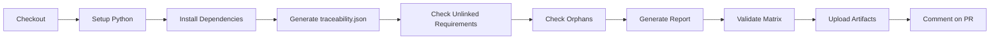
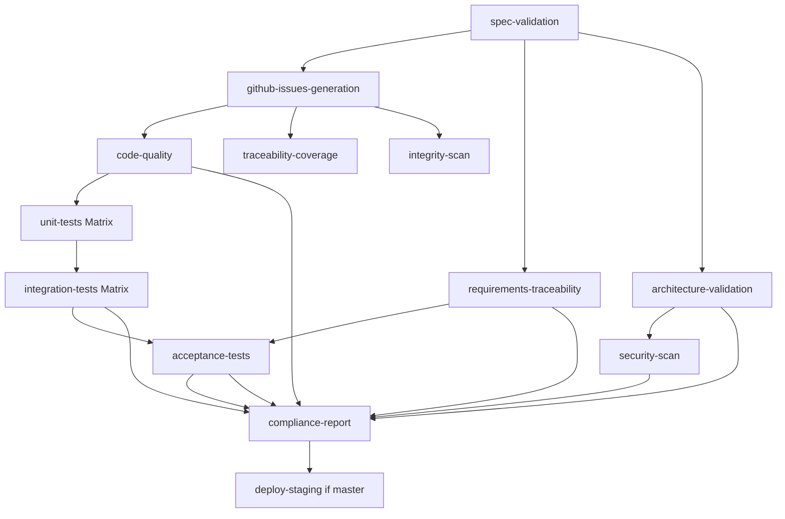

# CI/CD Workflows - GitHub Actions

**Standards**: ISO/IEC/IEEE 12207:2017 (Integration & Validation Processes)  
**XP Integration**: Continuous Integration, Automated Testing, Fast Feedback

---

## Overview

This template uses a **two-workflow strategy** for optimal developer experience:

| Workflow | Duration | Triggers | Purpose |
|----------|----------|----------|---------|
| **traceability-check.yml** | 2-3 min | PRs, Issues (opened/edited) | Fast feedback, early detection |
| **ci-standards-compliance.yml** | 10-15 min | Push, PRs, Schedule | Complete validation with tests |

Both workflows run on PRs in parallel:
- ✅ **Traceability Check**: Quick validation with PR comment
- ✅ **Full CI**: Complete standards compliance validation

---

## Workflow 1: Traceability Check (Fast)

**File**: `.github/workflows/traceability-check.yml`  
**Duration**: 2-3 minutes  
**Purpose**: Lightweight traceability validation with fast feedback

### Triggers

```yaml
on:
  pull_request:
    types: [opened, synchronize, reopened]
  issues:
    types: [opened, edited]  # Validates immediately when issues change!
  workflow_dispatch:          # Manual trigger
```

### Job Flow



### Key Steps

1. **Generate traceability.json from GitHub Issues**
   ```bash
   python scripts/github-issues-to-traceability-json.py
   ```
   - Fetches all issues via PyGithub
   - Extracts #N links from issue bodies
   - Builds bidirectional traceability
   - Outputs: `build/traceability.json`

2. **Check for unlinked requirements**
   ```bash
   python scripts/trace_unlinked_requirements.py --markdown
   ```
   - Reads from `build/traceability.json`
   - Checks ADR linkage (forward + backward)
   - Outputs markdown table

3. **Check for orphaned requirements**
   ```bash
   python scripts/github-orphan-check.py
   ```
   - Finds requirements without parent issues
   - Outputs: `reports/orphan-check.log`

4. **Generate traceability report**
   ```bash
   python scripts/github-traceability-report.py > reports/github-traceability.md
   ```
   - Human-readable traceability matrix
   - Summary with counts and percentages

5. **Validate traceability matrix**
   ```bash
   python scripts/validate-traceability.py
   ```
   - Validates completeness (no unlinked requirements)
   - Exit code 1 if validation fails

6. **Comment on PR**
   - Automatically posts traceability summary to PR
   - Extracts `## Summary` section from report
   - Includes link to full artifacts

### Artifacts

- `traceability-artifacts/` (30 days retention)
  - `build/traceability.json` - Machine-readable traceability
  - `reports/github-traceability.md` - Human-readable matrix
  - `reports/orphan-check.log` - Orphan requirements
- `traceability-report/` (30 days retention)
  - `reports/github-traceability.md` - PR comment source

### When to Use

- ✅ **During PR review**: Get quick traceability feedback
- ✅ **When creating issues**: Validates links immediately
- ✅ **Before full CI**: Catch missing links early
- ✅ **For quick checks**: Manual trigger via Actions tab

### Benefits

- ⚡ **Fast**: 2-3 minutes vs. 10-15 minutes for full CI
- 🔍 **Early Detection**: Catches missing links immediately
- 💬 **PR Integration**: Automatic traceability summary comment
- 🚀 **Reduced Friction**: Developers get quick feedback

---

## Workflow 2: CI Standards Compliance (Complete)

**File**: `.github/workflows/ci-standards-compliance.yml`  
**Duration**: 10-15 minutes  
**Purpose**: Comprehensive standards compliance validation with matrix testing

### Triggers

```yaml
on:
  push:
    branches: [master, develop, "feature/**", "release/**"]
  pull_request:
    branches: [master, develop]
  schedule:
    - cron: "0 2 * * 0"  # Daily at 2 AM UTC Sunday
  workflow_dispatch:      # Manual trigger
```

### Job Flow



### Jobs

#### 1. spec-validation

**Purpose**: Validate GitHub Issues structure  
**Duration**: 1-2 min

- Checks for GitHub Issues with proper labels
- Runs `github-traceability-report.py` for initial validation
- Fails if no requirements found

#### 2. github-issues-generation

**Purpose**: Generate artifacts from GitHub Issues  
**Duration**: 2-3 min  
**Depends on**: `spec-validation`

**Generated Artifacts**:
```
build/
├── spec-index.json          # Placeholder for compatibility
├── traceability.json        # Main traceability data
└── integrity-scan.json      # High-priority requirements

reports/
└── traceability-report.md   # Human-readable matrix

05-implementation/tests/generated/
└── README.md                # Test skeleton placeholder
```

**Key Script**:
```bash
python scripts/github-issues-to-traceability-json.py
```

**Uploaded as**: `spec-generated-artifacts` (reused by downstream jobs)

#### 3. code-quality

**Purpose**: Code quality and standards validation  
**Duration**: 2-3 min  
**Depends on**: `github-issues-generation`

- Markdown documentation validation
- Source code existence check
- Linting (if applicable)

#### 4. unit-tests

**Purpose**: XP Test-Driven Development validation  
**Duration**: 3-5 min per matrix job  
**Depends on**: `github-issues-generation`

**Matrix Strategy**:
```yaml
matrix:
  os: [ubuntu-latest, windows-latest, macos-latest]
  config: [Debug, Release]
# 6 jobs total (3 OS × 2 configs)
```

**Build Systems Supported**:
- CMake (with Ninja)
- PlatformIO
- Make
- CMake subdirectory (e.g., `test/test_audio/CMakeLists.txt`)

**Auto-detection**: Detects build system from project structure

#### 5. traceability-coverage

**Purpose**: Enforce minimum requirement linkage coverage  
**Duration**: 1-2 min  
**Depends on**: `github-issues-generation`

- Downloads `spec-generated-artifacts`
- Runs `validate-trace-coverage.py --min-req 90`
- Enforces `MIN_REQ_LINKAGE_COVERAGE=90%`

#### 6. integrity-scan

**Purpose**: Display high-integrity (P0/P1) requirements  
**Duration**: 1 min  
**Depends on**: `github-issues-generation`

- Downloads `build/integrity-scan.json`
- Lists high-priority requirements needing extra scrutiny
- Non-blocking (informational)

#### 7. integration-tests

**Purpose**: XP Continuous Integration validation  
**Duration**: 3-5 min per matrix job  
**Depends on**: `unit-tests`

**Matrix Strategy**: Same as unit-tests (6 jobs)

**Test Detection**:
- Looks for `test/integration/` or `tests/integration/`
- Searches for `*integration*` test files
- Uses CTest label `-L integration`

#### 8. requirements-traceability

**Purpose**: ISO/IEC/IEEE 29148:2018 traceability validation  
**Duration**: 2-3 min  
**Depends on**: `spec-validation`

**Scripts Executed**:
1. `trace_unlinked_requirements.py` → `reports/unlinked-requirements.log`
2. `github-orphan-check.py` → `reports/orphan-check.log`
3. `github-traceability-report.py` → `reports/github-traceability.md`
4. `validate-traceability.py` → `reports/traceability-validation.log`

**Uploaded as**: `traceability-reports`

#### 9. acceptance-tests

**Purpose**: XP Customer Tests + IEEE 1012 validation  
**Duration**: 2-3 min  
**Depends on**: `integration-tests`

- Queries GitHub Issues with `test-case` label
- Validates acceptance criteria in issue bodies
- Checks for "Verified by" links
- Reports validation coverage percentage

#### 10. architecture-validation

**Purpose**: ISO/IEC/IEEE 42010:2011 architecture compliance  
**Duration**: 1-2 min  
**Depends on**: `spec-validation`

**Validations**:
- ADR Impact Scan (`adr_impact_scan.py`)
- ADR completeness (Status, Context, Decision, Consequences)
- Architecture views (logical, process, development, physical, data)
- Quality attribute scenarios (Performance, Availability, Security)

#### 11. security-scan

**Purpose**: Security vulnerability scanning  
**Duration**: 2-3 min

- Sensitive data scan (passwords, secrets, api_key, token)
- Trivy vulnerability scanner
- Uploads SARIF to GitHub Security

#### 12. compliance-report

**Purpose**: Generate comprehensive standards compliance report  
**Duration**: 1 min  
**Depends on**: All validation jobs  
**Condition**: `if: always()` (runs even if some jobs fail)

**Report Contents**:
- ISO/IEC/IEEE 12207:2017 lifecycle coverage
- ISO/IEC/IEEE 29148:2018 requirements engineering
- IEEE 1016-2009 design descriptions
- ISO/IEC/IEEE 42010:2011 architecture
- IEEE 1012-2016 verification & validation
- XP practices compliance
- Quality metrics table
- Overall build status

**Actions**:
- Downloads all artifacts
- Generates `compliance-report.md`
- Uploads as artifact
- Comments on PR with full report

#### 13. deploy-staging

**Purpose**: Phase 08 deployment to staging  
**Duration**: 3-5 min  
**Depends on**: `code-quality`, `unit-tests`, `integration-tests`, `acceptance-tests`, `security-scan`  
**Condition**: `if: github.ref == 'refs/heads/master' && github.event_name == 'push'`

- Only runs on master branch pushes
- Builds firmware/artifacts
- Uploads deployment artifacts (90 days retention)

---

## Environment Variables

Both workflows use these environment variables:

```yaml
env:
  NODE_VERSION: "20.x"
  PYTHON_VERSION: "3.11"
  MIN_TEST_COVERAGE: 80           # Minimum code coverage %
  MAX_CYCLOMATIC_COMPLEXITY: 10   # Maximum complexity
  MIN_REQ_LINKAGE_COVERAGE: 90    # Minimum requirement linkage %
```

### GitHub Secrets Required

- `GITHUB_TOKEN` - Automatically provided by GitHub Actions
  - Used for: GitHub Issues API, artifact uploads, PR comments

### Repository Auto-Detection

All scripts automatically detect the repository from environment variables:

**In GitHub Actions** (automatic):
```yaml
env:
  GITHUB_REPOSITORY: ${{ github.repository }}  # Auto-set to "owner/repo"
```

**For local testing** (manual):
```bash
# Option 1: Use GITHUB_REPOSITORY (recommended)
export GITHUB_REPOSITORY=owner/repo

# Option 2: Set REPO_OWNER and REPO_NAME separately
export REPO_OWNER=zarfld
export REPO_NAME=copilot-instructions-template

# Then run scripts
export GITHUB_TOKEN=ghp_xxx
python scripts/github-traceability-report.py
```

**Fallback**: If no environment variables are set, defaults to `zarfld/copilot-instructions-template`

---

## Dependencies

Both workflows require:

```bash
pip install -r requirements.txt
# Or manually:
pip install PyGithub requests pyyaml markdown
```

See `requirements.txt` in repository root.

---

## Artifacts

### Traceability Check Artifacts

| Artifact | Retention | Contents |
|----------|-----------|----------|
| `traceability-artifacts` | 30 days | `build/traceability.json`, `reports/github-traceability.md`, `reports/orphan-check.log` |
| `traceability-report` | 30 days | `reports/github-traceability.md` (for PR comment) |

### Full CI Artifacts

| Artifact | Retention | Contents |
|----------|-----------|----------|
| `spec-generated-artifacts` | Default | All generated artifacts from `github-issues-generation` job |
| `traceability-reports` | Default | All traceability reports from `requirements-traceability` job |
| `compliance-report` | Default | Standards compliance summary report |
| `esp32-firmware` (if applicable) | 90 days | Built firmware for deployment |

---

## Workflow Strategy: When Each Runs

### On Pull Request (both run in parallel)

```
PR opened/updated
├── traceability-check.yml (2-3 min)
│   └── Posts quick traceability summary comment
└── ci-standards-compliance.yml (10-15 min)
    └── Full validation with matrix testing
```

### On Issue Created/Edited

```
Issue created/edited
└── traceability-check.yml (2-3 min)
    └── Validates links immediately
```

### On Push to Protected Branches

```
Push to master/develop/feature/**
└── ci-standards-compliance.yml (10-15 min)
    └── Full CI/CD pipeline
    └── Deploy if master branch
```

### Scheduled (Daily)

```
Daily at 2 AM UTC Sunday
└── ci-standards-compliance.yml (10-15 min)
    └── Full compliance check
```

---

## Quality Gates

Both workflows enforce these quality gates:

### Phase 01-02: Requirements (ISO/IEC/IEEE 29148:2018)

- ✅ GitHub Issues with proper labels exist
- ✅ Requirements have parent links (no orphans)
- ✅ Bidirectional traceability (StR ↔ REQ ↔ TEST ↔ CODE)
- ✅ Acceptance criteria defined in issue bodies
- ✅ Minimum 90% requirement linkage coverage

### Phase 03: Architecture (ISO/IEC/IEEE 42010:2011)

- ✅ ADRs have required sections (Status, Context, Decision, Consequences)
- ✅ Architecture views documented
- ✅ Quality attribute scenarios defined

### Phase 05: Implementation (XP TDD)

- ✅ Unit tests pass on all platforms (Windows/Linux/macOS)
- ✅ Debug and Release configurations pass
- ✅ Code coverage ≥ 80%
- ✅ Cyclomatic complexity ≤ 10

### Phase 06: Integration (XP CI)

- ✅ Integration tests pass on all platforms
- ✅ Tests run multiple times daily (on every push)
- ✅ Build reproducible across platforms

### Phase 07: Verification & Validation (IEEE 1012)

- ✅ Acceptance tests validate requirements
- ✅ Test cases linked to requirements
- ✅ Traceability matrix complete

### Security

- ✅ No sensitive data in source
- ✅ No high/critical vulnerabilities (Trivy)

---

## Debugging Workflows

### View Workflow Runs

1. Go to repository → **Actions** tab
2. Select workflow: `Traceability Validation` or `CI - Standards Compliance & Quality Gates`
3. Click on specific run to see job details

### Download Artifacts

1. Go to workflow run
2. Scroll to **Artifacts** section
3. Download artifacts (e.g., `traceability-artifacts`, `compliance-report`)

### Manual Trigger

Both workflows support manual triggering:

1. Go to **Actions** tab
2. Select workflow
3. Click **Run workflow** button
4. Select branch
5. Click **Run workflow**

### Common Issues

#### "No requirements found"

**Cause**: No GitHub Issues with proper labels exist  
**Solution**:
1. Create issues using templates in `.github/ISSUE_TEMPLATE/`
2. Ensure labels like `phase:02-requirements`, `type:requirement:functional` are applied
3. See `docs/QUICK-START-github-issues.md` for guidance

#### "Traceability validation failed"

**Cause**: Requirements missing links to ADR/tests  
**Solution**:
1. Check `reports/github-traceability.md` artifact for details
2. Add "Traces to: #N" to requirement issue bodies
3. Add "Verified by: #N" to link tests

#### "Matrix tests failed"

**Cause**: Tests fail on specific OS/config  
**Solution**:
1. Check specific matrix job logs
2. May require hardware or platform-specific setup
3. Update tests or exclude problematic combinations in matrix

---

## Workflow Customization

### Adjust Test Coverage Threshold

Edit `.github/workflows/ci-standards-compliance.yml`:

```yaml
env:
  MIN_TEST_COVERAGE: 80  # Change to desired %
```

### Add/Remove Matrix Combinations

Edit matrix in `unit-tests` or `integration-tests`:

```yaml
strategy:
  matrix:
    os: [ubuntu-latest, windows-latest, macos-latest]
    config: [Debug, Release]
    exclude:  # Optional: skip specific combinations
      - os: macos-latest
        config: Debug
```

### Disable Specific Jobs

Add `if: false` to skip a job:

```yaml
security-scan:
  if: false  # Temporarily disable
  name: Security Scan
  runs-on: ubuntu-latest
  ...
```

### Change Schedule

Edit cron expression:

```yaml
schedule:
  - cron: "0 2 * * 0"  # Sunday 2 AM UTC
  # Format: minute hour day-of-month month day-of-week
```

---

## Best Practices

### For Developers

1. **Create issues first**: Before implementing, create GitHub Issues with proper labels
2. **Link issues early**: Add "Traces to: #N" when creating child issues
3. **Watch traceability checks**: Review PR comments from traceability-check workflow
4. **Fix orphans immediately**: Don't let unlinked requirements accumulate
5. **Run local tests**: Ensure tests pass locally before pushing

### For Reviewers

1. **Check traceability comment**: Review automated traceability summary on PRs
2. **Download artifacts**: Check `traceability-artifacts` for detailed reports
3. **Validate coverage**: Ensure requirement linkage meets 90% threshold
4. **Review compliance report**: Check standards compliance status

### For Maintainers

1. **Monitor daily runs**: Check scheduled workflow runs for regressions
2. **Update dependencies**: Keep `requirements.txt` and workflow actions up-to-date
3. **Adjust thresholds**: Increase MIN_REQ_LINKAGE_COVERAGE as project matures
4. **Archive artifacts**: Download important artifacts before retention expires

---

## Standards Compliance

Both workflows enforce compliance with:

- **ISO/IEC/IEEE 12207:2017** - Software life cycle processes (all 9 phases)
- **ISO/IEC/IEEE 29148:2018** - Requirements engineering (Phase 01-02)
- **ISO/IEC/IEEE 42010:2011** - Architecture description (Phase 03)
- **IEEE 1016-2009** - Software design descriptions (Phase 04)
- **IEEE 1012-2016** - Verification and validation (Phase 07)

## XP Practices Integration

Both workflows support XP practices:

- **Test-Driven Development**: Unit tests run before merge
- **Continuous Integration**: Tests run on every push, multiple times daily
- **Pair Programming**: Supported via PR reviews and pair code reviews
- **Simple Design**: Enforced via complexity checks (≤10)
- **Refactoring**: Supported via continuous test coverage
- **Collective Ownership**: All changes validated by CI
- **Coding Standards**: Enforced via linting and quality checks

---

## Related Documentation

- [Script Documentation](../scripts/README.md) - Detailed script usage
- [Script Comparison Analysis](script-comparison-analysis.md) - Why these scripts were chosen
- [GitHub Issues Quick Start](QUICK-START-github-issues.md) - Creating and linking issues
- [Lifecycle Guide](lifecycle-guide.md) - Complete development lifecycle
- [XP Practices](xp-practices.md) - Extreme Programming practices

---

**Last Updated**: 2025-11-24  
**Version**: 2.0 (Post-ESP_ClapMetronome migration)
