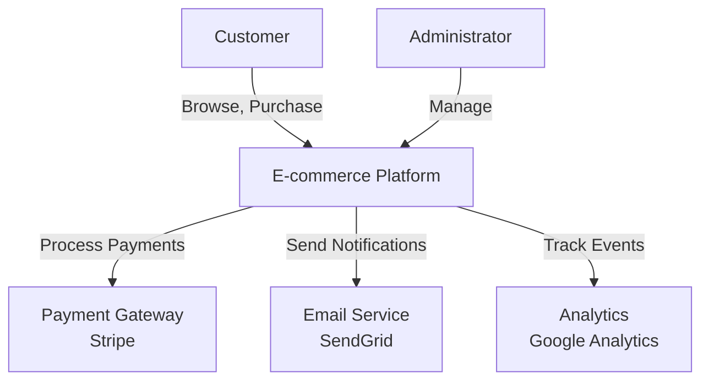

# GitHub Copilot Usage Guide

This guide shows you how to maximize GitHub Copilot's effectiveness when working with this standards-compliant template repository.

---

## How Copilot Works in This Repository

### Phase-Specific Context Loading

Copilot automatically loads phase-specific instructions based on your current directory:

```
📁 Your Location                      → 🤖 Copilot Context Loaded
────────────────────────────────────────────────────────────────
01-stakeholder-requirements/          → IEEE 29148 Stakeholder Requirements
                                       → Planning Game (XP)
                                       → Stakeholder identification

02-requirements/                       → ISO/IEC/IEEE 29148 System Requirements
                                       → User Stories (XP)
                                       → YAGNI, Given-When-Then

03-architecture/                       → ISO/IEC/IEEE 42010 Architecture
                                       → ADR format, C4 diagrams
                                       → Simple Design (XP)

04-design/                            → IEEE 1016 Software Design
                                       → CRC cards, design patterns
                                       → SOLID principles

05-implementation/                     → TDD Red-Green-Refactor (XP)
                                       → Pair Programming
                                       → Clean Code, refactoring

06-integration/                        → Continuous Integration (XP)
                                       → Integration testing
                                       → CI/CD pipelines

07-verification-validation/            → IEEE 1012 V&V Process
                                       → Acceptance Testing (XP)
                                       → Traceability matrix

08-transition/                         → Deployment strategies
                                       → Small Releases (XP)
                                       → Operations manual

09-operation-maintenance/              → Incident response
                                       → Monitoring
                                       → Sustainable Pace (XP)
```

---

## GitHub Issues Workflow with Copilot

Copilot can generate GitHub Issue bodies, validate traceability, and maintain issue-code consistency throughout the development lifecycle.

### Generating Issue Bodies

**Prompt**: "Generate a GitHub Issue body for stakeholder requirement: User Authentication"

**Copilot Response**:

```markdown
## Title
StR-001: User Authentication

## Description
Users need secure authentication to access protected features and personalized content.

## Business Need
Enable user-specific functionality while protecting user data and maintaining security compliance.

## Stakeholders
- **Product Owner**: Jane Doe (jane@example.com)
- **End Users**: Customers, Administrators
- **Security Team**: John Smith (security lead)
- **Compliance**: Legal team

## Business Context
- Market requirement: All competitors offer secure login
- Regulatory: GDPR requires user consent tracking
- Revenue impact: Personalization increases retention by 30%

## Acceptance Criteria
- [ ] Users can register with email/password
- [ ] Users can log in securely
- [ ] Password reset functionality available
- [ ] Multi-factor authentication (MFA) optional
- [ ] Session management with auto-logout
- [ ] Audit log of authentication events

## Priority
Critical (P0)

## Labels
`type:stakeholder-requirement`, `phase:01-stakeholder-requirements`, `priority:critical`

## Traceability
- **Verified by**: (to be linked when tests created)
- **Refined by**: (to be linked when requirements decomposed)
```

### Generating Functional Requirements from StR

**Prompt**: "Generate REQ-F issue body from StR issue #1 (User Authentication), focus on login"

**Copilot Response**:

```markdown
## Title
REQ-F-AUTH-001: User Login with Email/Password

## Description
System shall authenticate users using email address and password credentials, creating a secure session upon successful validation.

## Detailed Requirements

### Input Validation
- Email format validation (RFC 5322)
- Password minimum 8 characters
- Rate limiting: 5 attempts per minute per IP

### Authentication Flow
1. User submits email + password
2. System retrieves user record by email
3. System validates password against bcrypt hash
4. System creates JWT session token (24h expiry)
5. System returns token to client

### Security Requirements
- Passwords hashed with bcrypt (cost factor 12)
- JWT tokens signed with HS256
- Failed attempts logged for security monitoring
- Account lock after 10 failed attempts (unlock via email)

## Acceptance Criteria

**Scenario 1: Successful Login**
```gherkin
Given a registered user with email "test@example.com"
And correct password "SecurePass123!"
When user submits login form
Then system returns 200 OK
And JWT token is included in response
And token is valid for 24 hours
And user is redirected to dashboard
```

**Scenario 2: Invalid Credentials**
```gherkin
Given a registered user
And incorrect password
When user submits login form
Then system returns 401 Unauthorized
And error message "Invalid credentials" is displayed
And failed attempt is logged
```

**Scenario 3: Account Locked**
```gherkin
Given a user with 10 failed login attempts
When user submits correct credentials
Then system returns 403 Forbidden
And error message "Account locked. Check your email." is displayed
And unlock email is sent to user
```

## API Contract

```typescript
POST /api/auth/login
Request: {
  email: string;    // RFC 5322 format
  password: string; // min 8 characters
}
Response 200: {
  token: string;    // JWT token
  expiresIn: number; // 86400 (24 hours in seconds)
  user: {
    id: string;
    email: string;
    name: string;
  }
}
Response 401: {
  error: "Invalid credentials"
}
Response 403: {
  error: "Account locked. Check your email."
}
Response 429: {
  error: "Too many attempts. Try again later."
}
```

## Non-Functional Requirements

- **Performance**: Login completes in <200ms (P95)
- **Availability**: 99.9% uptime
- **Security**: Compliant with OWASP Top 10
- **Scalability**: Handle 1000 concurrent logins

## Dependencies

- User registration (REQ-F-AUTH-000) must be implemented first
- Email service for password reset/unlock notifications
- Database: PostgreSQL with users table
- Libraries: bcrypt (v5.x), jsonwebtoken (v9.x)

## Test Requirements

- Unit tests: Password validation, bcrypt hashing, JWT generation
- Integration tests: Full login flow with database
- Security tests: SQL injection, brute force, session hijacking
- Performance tests: 1000 concurrent login requests

## Implementation Notes

See detailed specification: `02-requirements/functional/auth-spec.md`

## Priority
Critical (P0)

## Labels
`type:requirement:functional`, `phase:02-requirements`, `priority:critical`

## Traceability
- Traces to:  #1 (StR-001: User Authentication)
- **Depends on**: None
- **Verified by**: (to be linked when TEST issue created)
- **Implemented by**: (to be linked when PR created)
```

### Generating ADR Issues

**Prompt**: "Generate ADR issue for database selection, considering PostgreSQL vs MongoDB"

**Copilot Response**:

```markdown
## Title
ADR-DATA-001: Use PostgreSQL for Primary Database

## Status
Proposed → Under Review → Accepted → Superseded

Current: Proposed

## Context

We need to select a primary database for our application. Key requirements from requirements analysis:

- **REQ-NF-DATA-001**: ACID transactions required (payment processing)
- **REQ-NF-PERF-002**: Complex queries for reporting and analytics
- **REQ-F-DATA-003**: Structured data with relationships (users, orders, products)
- **REQ-NF-SCALE-001**: Scale to 10,000 users initially, 100,000 within 2 years
- **REQ-NF-COST-001**: Minimize infrastructure costs

Team Expertise:
- 3 developers with strong SQL experience
- 0 developers with production MongoDB experience

## Decision

We will use **PostgreSQL 15+** as our primary database.

## Alternatives Considered

### Option 1: PostgreSQL (SELECTED)

**Pros**:
- ✅ Full ACID compliance (critical for payments)
- ✅ Powerful SQL query capabilities
- ✅ JSON support (JSONB) for semi-structured data
- ✅ Mature ecosystem (pgAdmin, Flyway, various ORMs)
- ✅ Team has SQL expertise
- ✅ Cost-effective (open source)
- ✅ Proven scalability (millions of rows)
- ✅ Built-in full-text search
- ✅ Strong consistency guarantees

**Cons**:
- ⚠️ Vertical scaling limits (can be addressed with partitioning/sharding)
- ⚠️ Requires more planning for horizontal scaling

**Risk Assessment**: Low risk, well-understood technology

### Option 2: MongoDB (REJECTED)

**Pros**:
- ✅ Flexible schema (easy schema evolution)
- ✅ Horizontal scaling built-in (sharding)
- ✅ High write throughput

**Cons**:
- ❌ Eventual consistency model (risky for payments)
- ❌ Limited transaction support (improved in 4.x but not comparable to PostgreSQL)
- ❌ No team expertise (training required)
- ❌ Weaker consistency guarantees
- ❌ More complex for relational data
- ❌ Higher infrastructure costs (Atlas pricing)

**Risk Assessment**: Medium risk due to team inexperience and consistency concerns

### Option 3: Hybrid (PostgreSQL + MongoDB) (REJECTED)

**Pros**:
- ✅ Best of both worlds

**Cons**:
- ❌ Operational complexity (two databases to maintain)
- ❌ Data consistency challenges
- ❌ Higher costs
- ❌ Small team cannot support multiple databases effectively

**Risk Assessment**: High risk due to complexity

## Consequences

### Positive

1. **ACID Compliance**: Payment transactions are guaranteed to be atomic
2. **Team Productivity**: Leverage existing SQL skills, faster development
3. **Rich Query Capabilities**: Complex joins and analytics without performance penalties
4. **Cost-Effective**: No licensing fees, lower cloud costs than managed NoSQL
5. **Ecosystem Maturity**: Excellent tooling for migrations, monitoring, backups

### Negative

1. **Scaling Complexity**: Will require partitioning/sharding if we exceed 10M rows
2. **Schema Migrations**: Schema changes require planned migrations (mitigated by Flyway)
3. **NoSQL Flexibility**: Less flexible than document databases for rapidly changing schemas

### Neutral

1. **JSON Support**: PostgreSQL JSONB provides document store capabilities when needed
2. **Future Migration Path**: Can add MongoDB later for specific use cases (caching, logs) if needed

## Implementation Plan

1. **Immediate** (Sprint 1):
   - Set up PostgreSQL 15 on AWS RDS
   - Configure connection pooling (PgBouncer)
   - Set up automated backups (daily)

2. **Short-term** (Sprint 2-3):
   - Implement schema migration pipeline (Flyway)
   - Set up monitoring (CloudWatch + pgBadger)
   - Configure read replicas for reporting queries

3. **Long-term** (Future):
   - If scale requires, implement table partitioning
   - Consider Citus extension for horizontal scaling
   - Monitor performance; optimize with indexes and query tuning

## Review and Approval

- **Proposed by**: @tech-lead
- **Reviewed by**: @architect, @devops-lead
- **Approval required from**: @cto

## Requirements Satisfied

- **REQ-NF-DATA-001**: ✅ ACID transactions
- **REQ-NF-PERF-002**: ✅ Complex query support
- **REQ-F-DATA-003**: ✅ Relational data model
- **REQ-NF-SCALE-001**: ✅ Scales to 100,000 users
- **REQ-NF-COST-001**: ✅ Cost-effective

## Labels
`type:architecture:decision`, `phase:03-architecture`, `priority:critical`, `status:proposed`

## Traceability
- **Addresses**: #5 (REQ-NF-DATA-001: ACID Compliance), #6 (REQ-NF-PERF-002: Query Performance)
- **Impacts**: #12 (ARC-C-DATA-001: Data Layer Component)
- **Implemented by**: (to be linked when infrastructure PR created)
```

### Generating TEST Issues

**Prompt**: "Generate TEST issue for requirement #2 (REQ-F-AUTH-001: User Login)"

**Copilot Response**:

```markdown
## Title
TEST-AUTH-LOGIN-001: User Login Integration Test

## Test Objective
Verify that users can successfully authenticate with valid credentials and receive a valid JWT token.

## Test Type
Integration Test

## Verifies
- **Requirement**: #2 (REQ-F-AUTH-001: User Login with Email/Password)
- **Component**: Authentication Service
- **API**: POST /api/auth/login

## Preconditions
- PostgreSQL database is running
- Test user exists in database:
  - Email: test@example.com
  - Password: TestPassword123!
  - Account status: Active
- Authentication service is running on localhost:3000

## Test Data

```json
{
  "validUser": {
    "email": "test@example.com",
    "password": "TestPassword123!"
  },
  "invalidPassword": {
    "email": "test@example.com",
    "password": "WrongPassword"
  },
  "nonExistentUser": {
    "email": "nonexistent@example.com",
    "password": "SomePassword123!"
  },
  "invalidEmail": {
    "email": "not-an-email",
    "password": "TestPassword123!"
  }
}
```

## Test Cases

### TC-001: Successful Login with Valid Credentials

**Steps**:
1. Send POST /api/auth/login with valid credentials
2. Capture response

**Expected Result**:
```json
{
  "status": 200,
  "body": {
    "token": "<valid-jwt-token>",
    "expiresIn": 86400,
    "user": {
      "id": "<user-id>",
      "email": "test@example.com",
      "name": "Test User"
    }
  }
}
```

**Validation**:
- [ ] Status code is 200
- [ ] Token is present and non-empty
- [ ] Token is valid JWT (can be decoded)
- [ ] Token contains user ID claim
- [ ] Token expires in 86400 seconds (24 hours)
- [ ] User object contains id, email, name

### TC-002: Login with Invalid Password

**Steps**:
1. Send POST /api/auth/login with invalid password
2. Capture response

**Expected Result**:
```json
{
  "status": 401,
  "body": {
    "error": "Invalid credentials"
  }
}
```

**Validation**:
- [ ] Status code is 401
- [ ] Error message is "Invalid credentials"
- [ ] No token in response
- [ ] Failed attempt logged in audit log

### TC-003: Login with Non-Existent User

**Steps**:
1. Send POST /api/auth/login with non-existent email
2. Capture response

**Expected Result**:
```json
{
  "status": 401,
  "body": {
    "error": "Invalid credentials"
  }
}
```

**Validation**:
- [ ] Status code is 401
- [ ] Error message does NOT reveal user existence (security)
- [ ] Response time similar to valid user (prevent user enumeration)

### TC-004: Login with Invalid Email Format

**Steps**:
1. Send POST /api/auth/login with invalid email format
2. Capture response

**Expected Result**:
```json
{
  "status": 400,
  "body": {
    "error": "Invalid email format"
  }
}
```

**Validation**:
- [ ] Status code is 400
- [ ] Error message indicates email format issue

### TC-005: Rate Limiting

**Steps**:
1. Send 6 login requests within 1 minute from same IP
2. Capture 6th response

**Expected Result**:
```json
{
  "status": 429,
  "body": {
    "error": "Too many attempts. Try again later."
  }
}
```

**Validation**:
- [ ] First 5 requests succeed/fail normally
- [ ] 6th request returns 429
- [ ] Rate limit resets after 1 minute

## Test Implementation

**File**: `tests/integration/auth-login.test.ts`

**Test Framework**: Jest + Supertest

**Estimated Duration**: ~500ms (includes database setup/teardown)

## Acceptance Criteria (from #2)
- [x] User can enter email and password
- [x] System validates credentials
- [x] User redirected on success (tested via 200 response)
- [x] Error message on failure

## Automation
- [x] Runs in CI/CD pipeline
- [x] Runs before every deployment
- [x] Included in nightly test suite

## Coverage
- Line coverage: 95%+
- Branch coverage: 90%+
- Function coverage: 100%

## Dependencies
- Database: PostgreSQL test instance
- Service: Authentication service
- Libraries: Jest, Supertest, jsonwebtoken (for token validation)

## Priority
Critical (P0)

## Labels
`type:test`, `test-type:integration`, `phase:07-verification-validation`, `priority:critical`

## Traceability
- **Verifies**: #2 (REQ-F-AUTH-001: User Login)
- Traces to:  #1 (StR-001: User Authentication)
- **Implemented by**: tests/integration/auth-login.test.ts
```

### Validating Traceability with Copilot

**Prompt**: "Validate traceability for requirement #2 (REQ-F-AUTH-001)"

**Copilot Response**:

```markdown
# Traceability Validation Report

## Requirement: #2 (REQ-F-AUTH-001: User Login)

### Forward Traceability ✅

```
#1 (StR-001: User Authentication)
  ↓ "Traces to"
#2 (REQ-F-AUTH-001: User Login)
  ↓ "Implemented by"
#PR-25 (feat: User login authentication)
  ↓ "Verified by"
#15 (TEST-AUTH-LOGIN-001: User Login Integration Test)
```

**Status**: ✅ Complete

### Backward Traceability ✅

```
#15 (TEST-AUTH-LOGIN-001)
  ↓ "Verifies"
#2 (REQ-F-AUTH-001)
  ↓ "Implements"
#1 (StR-001)
```

**Status**: ✅ Complete

### Code Traceability ✅

**Implementation Files**:
- `src/auth/auth.service.ts` (line 45):
  ```typescript
  /**
   * Implements: #2 (REQ-F-AUTH-001: User Login)
   */
  async login(email: string, password: string): Promise<AuthResult> {
  ```

- `tests/integration/auth-login.test.ts` (line 10):
  ```typescript
  /**
   * Verifies: #15 (TEST-AUTH-LOGIN-001)
   * Tests: #2 (REQ-F-AUTH-001)
   */
  describe('User Login Integration Test', () => {
  ```

**Status**: ✅ Complete

### Test Coverage ✅

- **Unit Tests**: 12 tests (auth.service.spec.ts)
- **Integration Tests**: 5 tests (auth-login.test.ts)
- **E2E Tests**: 2 tests (login.e2e.spec.ts)
- **Coverage**: 96% line, 92% branch

**Status**: ✅ Meets threshold (>80%)

### Documentation ✅

- **Requirement Spec**: `02-requirements/functional/auth-spec.md`
- **ADR**: #8 (ADR-SECU-001: JWT Authentication)
- **API Documentation**: `docs/api/auth.md`

**Status**: ✅ Complete

### Overall Traceability Score: 100% ✅

**Summary**:
- All traceability links present
- Code references issues correctly
- Tests verify requirement
- Documentation complete
- No orphan artifacts found

**Recommendation**: ✅ Requirement is fully traceable and ready for production
```

### Querying Issues with Copilot

**Prompt**: "Show me all requirements without test issues"

**Copilot Response**:

```bash
# GitHub CLI query to find requirements without TEST issues
gh issue list \
  --label "type:requirement:functional" \
  --json number,title,labels,body \
  --jq '.[] | select(.body | contains("Verified by") | not) | {number, title}'

# Output example:
{
  "number": 7,
  "title": "REQ-F-CART-002: Remove Item from Cart"
}
{
  "number": 12,
  "title": "REQ-F-ORDER-005: Cancel Order"
}

# Copilot suggestion: Create TEST issues for these requirements
```

**Prompt**: "Generate missing TEST issues for requirement #7"

**Copilot**: (Generates TEST issue body as shown above)

### CI/CD Validation with Copilot

**Prompt**: "Create a GitHub Actions workflow to validate issue traceability"

**Copilot Response**:

```yaml
# .github/workflows/validate-traceability.yml
name: Validate Traceability

on:
  pull_request:
    types: [opened, synchronize]
  push:
    branches: [main]

jobs:
  validate:
    runs-on: ubuntu-latest
    steps:
      - name: Checkout code
        uses: actions/checkout@v4

      - name: Set up Python
        uses: actions/setup-python@v4
        with:
          python-version: '3.11'

      - name: Install dependencies
        run: |
          pip install PyGithub requests

      - name: Validate issue links in code
        run: |
          python scripts/validate-issue-traceability.py

      - name: Check requirements have tests
        run: |
          python scripts/trace_unlinked_requirements.py

      - name: Generate traceability matrix
        run: |
          python scripts/generate-traceability-matrix.py --output-html

      - name: Upload traceability report
        uses: actions/upload-artifact@v3
        with:
          name: traceability-matrix
          path: traceability-matrix.html

      - name: Fail if traceability < 95%
        run: |
          SCORE=$(python scripts/get-traceability-score.py)
          if [ "$SCORE" -lt 95 ]; then
            echo "❌ Traceability score $SCORE% < 95%"
            exit 1
          else
            echo "✅ Traceability score $SCORE% >= 95%"
          fi
```

### Best Practices for GitHub Issues with Copilot

1. **Always reference issues in prompts**:
   - ✅ "Generate code for requirement #2"
   - ❌ "Generate user login code"

2. **Use issue numbers in code**:
   - Copilot recognizes `Implements: #N` patterns
   - Suggests traceability comments automatically

3. **Generate complete issue bodies**:
   - Include all sections: Description, Acceptance Criteria, Traceability, Labels
   - Copilot can fill in details from context

4. **Validate before creating issues**:
   - Ask Copilot: "Review this issue body for completeness"
   - Copilot checks for missing sections, unclear acceptance criteria

5. **Link issues bidirectionally**:
   - Parent issues list children
   - Child issues reference parents
   - Copilot helps maintain consistency

---

## Phase-by-Phase Copilot Usage

### Phase 01: Stakeholder Requirements

**Navigate to phase**:
```bash
cd 01-stakeholder-requirements
```

**Copilot Prompts**:

```
"Help me identify stakeholder classes for a <your system type> system"

Example response:
- End Users (customers using the product)
- Product Managers (define features)
- System Administrators (maintain system)
- Legal/Compliance Team (regulatory requirements)
- Support Team (help desk)
```

```
"Generate stakeholder interview questions for <stakeholder type>"

Example response:
For Product Manager:
1. What are the top 3 business goals?
2. Who are the primary users?
3. What problems does this solve?
4. What does success look like?
5. What are deal-breaker constraints?
```

```
"Convert this business need into stakeholder requirement: <describe need>"

Example response:
Business Need: "We need customers to find products quickly"

Stakeholder Requirement:
StR-001: Search Performance
- ID: StR-001
- Source: E-commerce Manager
- Need: Customers must find products within 3 seconds
- Rationale: Studies show >3s search time = 40% abandonment
- Acceptance: 95% of searches return results <3s
```

**File Pattern Recognition**:

When you create/edit files matching these patterns, Copilot provides context-aware suggestions:

```
stakeholder-*.md          → Suggests stakeholder templates
business-context.md       → Suggests business context questions
stakeholder-register.md   → Suggests stakeholder table format
```

---

### Phase 02: Requirements Analysis

**Navigate to phase**:
```bash
cd 02-requirements
```

**Copilot Prompts**:

```
"Write functional requirement for <feature description>"

Example response:
REQ-F-001: User Authentication
- Priority: MUST
- Description: System shall authenticate users via email and password
- Rationale: Protect user data and enable personalization
- Acceptance Criteria:
  - Given a registered user
  - When they enter valid credentials
  - Then they are granted access to their account
  - And session is created with 24-hour expiry
- Traces to: StR-005 (User Account Management)
```

```
"Generate non-functional requirements for <quality attribute>"

Example for Performance:
REQ-NF-001: Response Time
- Category: Performance
- Requirement: 95% of API requests complete in <500ms
- Measurement: P95 latency via APM
- Target: ≤500ms
- Current: N/A (new system)

REQ-NF-002: Throughput
- Category: Performance  
- Requirement: System handles 1000 concurrent users
- Measurement: Load testing results
- Target: 1000 users with <1% error rate
- Current: N/A
```

```
"Create use case for <user goal>"

Example response:
Use Case: UC-001 - Purchase Product

Actor: Customer
Goal: Complete purchase of items in cart

Preconditions:
- User is authenticated
- Cart contains at least one item
- Payment method is configured

Main Scenario:
1. Customer navigates to cart
2. System displays cart contents with totals
3. Customer clicks "Checkout"
4. System displays shipping options
5. Customer selects shipping method
6. System displays payment summary
7. Customer confirms order
8. System processes payment
9. System sends confirmation email
10. System displays order confirmation

Extensions:
3a. Cart is empty
    1. System displays "Cart is empty" message
    2. Use case ends
    
8a. Payment fails
    1. System displays error message
    2. Return to step 6
```

**Using Spec-Kit Templates**:

```bash
# Copy requirements template
cp ../spec-kit-templates/requirements-spec.md functional/feature-x-requirements.md

# Open in editor
code functional/feature-x-requirements.md

# Copilot automatically:
# ✅ Fills in YAML metadata
# ✅ Suggests functional requirements
# ✅ Generates Given-When-Then scenarios
# ✅ Creates traceability IDs
# ✅ Suggests non-functional requirements
```

**Inline Suggestions**:

When typing, Copilot suggests:

```markdown
## Functional Requirements

### REQ-F-001: [Copilot suggests: User Registration]

**Description**: [Copilot suggests: System shall allow new users to register...]

**Acceptance Criteria**:
- [Copilot suggests: Given an unregistered user]
- [Copilot suggests: When they submit valid registration form]
- [Copilot suggests: Then account is created]
```

---

### Phase 03: Architecture Design

**Navigate to phase**:
```bash
cd 03-architecture
```

**Copilot Prompts**:

```
"Help me choose between <architecture option A> and <architecture option B> for <your context>"

Example:
"Help me choose between microservices and monolith for a startup with 3 developers"

Copilot Response:
For a startup with 3 developers, I recommend starting with a **Modular Monolith**:

Reasons:
✅ Faster development (no distributed complexity)
✅ Easier debugging (single process)
✅ Lower operational overhead
✅ Can extract microservices later if needed

Recommendation: Use a well-structured monolith with:
- Clear module boundaries
- Domain-driven design
- Dependency injection
- Comprehensive tests

Migrate to microservices when:
- Team grows >15 developers
- Scaling challenges emerge
- Different modules need different tech stacks
```

```
"Create an Architecture Decision Record for <decision>"

Example:
"Create an ADR for database choice between PostgreSQL and MongoDB"

Copilot generates:
# ADR-001: Use PostgreSQL for Primary Database

## Status
Proposed

## Context
We need to choose a database for our e-commerce platform. Key requirements:
- ACID transactions (payment processing)
- Complex queries (reporting, analytics)
- Structured data (users, orders, products)
- Mature ecosystem
- Strong consistency guarantees

## Decision
We will use PostgreSQL as our primary database.

## Consequences

### Positive
- Full ACID compliance (critical for payments)
- Powerful query capabilities (SQL, JSON support)
- Mature tooling (backups, monitoring, migrations)
- Strong community support
- Cost-effective (open source)

### Negative
- May require more complex scaling than NoSQL
- Learning curve for developers unfamiliar with SQL
- Schema migrations require careful planning

### Neutral
- Requires proper indexing for performance
- Need to set up replication for HA

## Alternatives Considered

### MongoDB
❌ Rejected: Eventual consistency unacceptable for financial transactions
❌ Complex transactions only recently added
✅ Good for unstructured data (not our use case)

### MySQL
⚠️ Similar to PostgreSQL but:
- Weaker JSON support
- Less advanced query optimizer
- PostgreSQL chosen for superior feature set
```

**Using Spec-Kit Architecture Template**:

```bash
# Copy architecture template
cp ../spec-kit-templates/architecture-spec.md architecture-description.md

# Copilot helps you:
# ✅ Create C4 diagrams (Context, Container, Component)
# ✅ Write ADRs for major decisions
# ✅ Define architecture views (Logical, Process, Physical, Data)
# ✅ Document quality attributes
# ✅ Identify cross-cutting concerns
```

**Diagram Generation**:

```
"Generate C4 context diagram for <your system>"

Copilot generates Mermaid code:


---

### Phase 04: Detailed Design

**Navigate to phase**:
```bash
cd 04-design
```

**Copilot Prompts**:

```
"Design a class structure for <component description>"

Example:
"Design a class structure for order processing system"

Copilot generates:
```typescript
// Order Aggregate Root
class Order {
  private id: OrderId;
  private customerId: CustomerId;
  private items: OrderItem[];
  private status: OrderStatus;
  private totalAmount: Money;
  
  // Domain logic
  addItem(product: Product, quantity: number): void {
    const item = new OrderItem(product, quantity);
    this.items.push(item);
    this.recalculateTotal();
  }
  
  submit(): void {
    if (this.items.length === 0) {
      throw new Error('Cannot submit empty order');
    }
    this.status = OrderStatus.Pending;
  }
  
  complete(): void {
    if (this.status !== OrderStatus.Paid) {
      throw new Error('Cannot complete unpaid order');
    }
    this.status = OrderStatus.Completed;
  }
  
  private recalculateTotal(): void {
    this.totalAmount = this.items.reduce(
      (sum, item) => sum.add(item.subtotal),
      Money.zero()
    );
  }
}

// Value Objects
class OrderItem {
  constructor(
    public readonly product: Product,
    public readonly quantity: number
  ) {}
  
  get subtotal(): Money {
    return this.product.price.multiply(this.quantity);
  }
}

class Money {
  constructor(
    private amount: number,
    private currency: string
  ) {}
  
  add(other: Money): Money {
    if (this.currency !== other.currency) {
      throw new Error('Currency mismatch');
    }
    return new Money(this.amount + other.amount, this.currency);
  }
  
  multiply(factor: number): Money {
    return new Money(this.amount * factor, this.currency);
  }
  
  static zero(): Money {
    return new Money(0, 'USD');
  }
}

// Enums
enum OrderStatus {
  Draft = 'DRAFT',
  Pending = 'PENDING',
  Paid = 'PAID',
  Completed = 'COMPLETED',
  Cancelled = 'CANCELLED'
}
```
```

```
"Suggest design pattern for <problem description>"

Example:
"Suggest design pattern for calculating shipping costs based on multiple factors"

Copilot suggests:
**Strategy Pattern** is ideal for this problem.

Reasoning:
- Multiple shipping calculation algorithms (factors)
- Algorithm selection at runtime (based on order properties)
- Easy to add new shipping methods
- Follows Open-Closed Principle

Implementation:
```typescript
// Strategy Interface
interface ShippingCalculator {
  calculate(order: Order): Money;
}

// Concrete Strategies
class StandardShipping implements ShippingCalculator {
  calculate(order: Order): Money {
    const weight = order.getTotalWeight();
    return new Money(5 + (weight * 0.5), 'USD');
  }
}

class ExpressShipping implements ShippingCalculator {
  calculate(order: Order): Money {
    const weight = order.getTotalWeight();
    return new Money(15 + (weight * 1.0), 'USD');
  }
}

class FreeShipping implements ShippingCalculator {
  calculate(order: Order): Money {
    return Money.zero();
  }
}

// Context
class Order {
  private shippingCalculator: ShippingCalculator;
  
  setShippingMethod(calculator: ShippingCalculator): void {
    this.shippingCalculator = calculator;
  }
  
  getShippingCost(): Money {
    return this.shippingCalculator.calculate(this);
  }
}

// Usage
const order = new Order();
order.setShippingMethod(new ExpressShipping());
const cost = order.getShippingCost();
```
```

---

### Phase 05: Implementation (TDD with Copilot)

**Navigate to phase**:
```bash
cd 05-implementation
```

**TDD Red-Green-Refactor with Copilot**:

**Step 1: RED - Write Test First**

```typescript
// tests/user-service.test.ts
describe('UserService', () => {
  it('should create user with valid data', async () => {
    // Copilot suggests test structure:
    const userService = new UserService();
    const userData = {
      email: 'test@example.com',
      password: 'SecurePass123!',
      name: 'Test User'
    };
    
    const user = await userService.create(userData);
    
    expect(user.id).toBeDefined();
    expect(user.email).toBe('test@example.com');
    expect(user.name).toBe('Test User');
    // Copilot knows NOT to expose password
    expect(user).not.toHaveProperty('password');
  });
  
  it('should hash password before storing', async () => {
    // Copilot suggests security test:
    const userService = new UserService();
    const password = 'plaintext';
    
    const user = await userService.create({
      email: 'test@example.com',
      password,
      name: 'Test'
    });
    
    // Verify password is hashed
    const storedPassword = await userService.getPasswordHash(user.id);
    expect(storedPassword).not.toBe(password);
    expect(storedPassword.length).toBeGreaterThan(20); // bcrypt hash length
  });
});
```

**Step 2: GREEN - Write Implementation**

```typescript
// src/user-service.ts
// Type "class UserService" and Copilot suggests:
import * as bcrypt from 'bcrypt';
import { UserRepository } from './user-repository';

export class UserService {
  constructor(private userRepository: UserRepository) {}
  
  async create(userData: CreateUserDTO): Promise<User> {
    // Copilot suggests validation
    this.validateEmail(userData.email);
    this.validatePassword(userData.password);
    
    // Copilot suggests password hashing
    const passwordHash = await bcrypt.hash(userData.password, 10);
    
    // Copilot suggests creating user entity
    const user = await this.userRepository.create({
      email: userData.email,
      passwordHash,
      name: userData.name
    });
    
    // Copilot knows to return user without password
    return {
      id: user.id,
      email: user.email,
      name: user.name,
      createdAt: user.createdAt
    };
  }
  
  private validateEmail(email: string): void {
    // Copilot suggests email regex
    const emailRegex = /^[^\s@]+@[^\s@]+\.[^\s@]+$/;
    if (!emailRegex.test(email)) {
      throw new Error('Invalid email format');
    }
  }
  
  private validatePassword(password: string): void {
    // Copilot suggests password strength rules
    if (password.length < 8) {
      throw new Error('Password must be at least 8 characters');
    }
    if (!/[A-Z]/.test(password)) {
      throw new Error('Password must contain uppercase letter');
    }
    if (!/[a-z]/.test(password)) {
      throw new Error('Password must contain lowercase letter');
    }
    if (!/[0-9]/.test(password)) {
      throw new Error('Password must contain number');
    }
  }
  
  async getPasswordHash(userId: string): Promise<string> {
    const user = await this.userRepository.findById(userId);
    return user.passwordHash;
  }
}
```

**Step 3: REFACTOR - Improve Code**

Copilot suggests refactorings:

```typescript
// Copilot suggests extracting validation
class EmailValidator {
  private static readonly EMAIL_REGEX = /^[^\s@]+@[^\s@]+\.[^\s@]+$/;
  
  static validate(email: string): void {
    if (!this.EMAIL_REGEX.test(email)) {
      throw new ValidationError('Invalid email format');
    }
  }
}

class PasswordValidator {
  static validate(password: string): void {
    const rules = [
      { test: (p: string) => p.length >= 8, message: 'at least 8 characters' },
      { test: (p: string) => /[A-Z]/.test(p), message: 'uppercase letter' },
      { test: (p: string) => /[a-z]/.test(p), message: 'lowercase letter' },
      { test: (p: string) => /[0-9]/.test(p), message: 'number' }
    ];
    
    const failures = rules.filter(rule => !rule.test(password));
    if (failures.length > 0) {
      throw new ValidationError(
        `Password must contain: ${failures.map(f => f.message).join(', ')}`
      );
    }
  }
}

// Refactored UserService
export class UserService {
  constructor(
    private userRepository: UserRepository,
    private passwordHasher: PasswordHasher  // Copilot suggests dependency injection
  ) {}
  
  async create(userData: CreateUserDTO): Promise<User> {
    EmailValidator.validate(userData.email);
    PasswordValidator.validate(userData.password);
    
    const passwordHash = await this.passwordHasher.hash(userData.password);
    
    const user = await this.userRepository.create({
      ...userData,
      passwordHash
    });
    
    return this.toDTO(user);
  }
  
  private toDTO(user: UserEntity): User {
    return {
      id: user.id,
      email: user.email,
      name: user.name,
      createdAt: user.createdAt
    };
  }
}
```

**Copilot Refactoring Prompts**:

```
"Refactor this function to improve readability"
"Extract this logic into a separate method"
"Simplify this conditional"
"Remove duplication from these functions"
"Apply SOLID principles to this class"
```

---

### Phase 06: Integration

**Navigate to phase**:
```bash
cd 06-integration
```

**Copilot Prompts**:

```
"Write integration test for <API endpoint>"

Example:
"Write integration test for POST /api/users endpoint"

Copilot generates:
```typescript
// integration-tests/users-api.test.ts
import request from 'supertest';
import { app } from '../src/app';
import { database } from '../src/database';

describe('POST /api/users', () => {
  beforeAll(async () => {
    await database.connect();
  });
  
  afterAll(async () => {
    await database.disconnect();
  });
  
  beforeEach(async () => {
    await database.clear();  // Clean state for each test
  });
  
  it('should create user with valid data', async () => {
    const response = await request(app)
      .post('/api/users')
      .send({
        email: 'test@example.com',
        password: 'SecurePass123!',
        name: 'Test User'
      })
      .expect(201);
    
    expect(response.body).toMatchObject({
      id: expect.any(String),
      email: 'test@example.com',
      name: 'Test User'
    });
    expect(response.body).not.toHaveProperty('password');
    
    // Verify in database
    const user = await database.users.findByEmail('test@example.com');
    expect(user).toBeDefined();
    expect(user.passwordHash).not.toBe('SecurePass123!');
  });
  
  it('should return 400 for invalid email', async () => {
    await request(app)
      .post('/api/users')
      .send({
        email: 'invalid-email',
        password: 'SecurePass123!',
        name: 'Test User'
      })
      .expect(400);
  });
  
  it('should return 409 for duplicate email', async () => {
    // Create first user
    await request(app)
      .post('/api/users')
      .send({
        email: 'test@example.com',
        password: 'SecurePass123!',
        name: 'Test User 1'
      })
      .expect(201);
    
    // Try to create duplicate
    await request(app)
      .post('/api/users')
      .send({
        email: 'test@example.com',
        password: 'DifferentPass456!',
        name: 'Test User 2'
      })
      .expect(409);
  });
});
```
```

```
"Create GitHub Actions workflow for CI"

Copilot generates:
(See .github/workflows/ci-standards-compliance.yml)
```

---

### Phase 07: Verification & Validation

**Navigate to phase**:
```bash
cd 07-verification-validation
```

**Copilot Prompts**:

```
"Generate acceptance test in Gherkin for <feature>"

Example:
"Generate acceptance test for user login feature"

Copilot generates:
```gherkin
Feature: User Login
  As a registered user
  I want to log in to my account
  So that I can access personalized features

  Background:
    Given the following users exist:
      | email              | password      | name       |
      | alice@example.com  | SecurePass1!  | Alice      |
      | bob@example.com    | SecurePass2!  | Bob        |

  Scenario: Successful login with valid credentials
    Given I am on the login page
    When I enter "alice@example.com" in the email field
    And I enter "SecurePass1!" in the password field
    And I click the "Login" button
    Then I should see "Welcome back, Alice!"
    And I should be redirected to "/dashboard"
    And I should see my profile picture

  Scenario: Failed login with incorrect password
    Given I am on the login page
    When I enter "alice@example.com" in the email field
    And I enter "WrongPassword" in the password field
    And I click the "Login" button
    Then I should see "Invalid credentials"
    And I should remain on the login page
    And the password field should be cleared
    And the password field should be focused

  Scenario: Failed login with unregistered email
    Given I am on the login page
    When I enter "nonexistent@example.com" in the email field
    And I enter "SomePassword" in the password field
    And I click the "Login" button
    Then I should see "Invalid credentials"
    And I should remain on the login page

  Scenario: Account lockout after failed attempts
    Given I am on the login page
    When I enter "alice@example.com" in the email field
    And I enter wrong password 5 times
    Then I should see "Account temporarily locked"
    And I should not be able to login for 15 minutes
    And an email should be sent to "alice@example.com"
```
```

```
"Generate traceability matrix from requirements to tests"

Copilot generates Python/TypeScript script to parse:
- Requirements (REQ-F-XXX, REQ-NF-XXX)
- Design elements (DES-XXX)
- Test cases (TEST-XXX)
- Code (search for traceability comments)

Outputs: Markdown table showing complete traceability
```

---

## Advanced Copilot Techniques

### 1. Copilot Chat for Complex Questions

Open Copilot Chat (Ctrl+Shift+I / Cmd+Shift+I) and ask:

```
"Explain the architecture pattern used in this codebase"

"What security vulnerabilities exist in this authentication code?"

"Suggest performance optimizations for this database query"

"How can I refactor this to follow SOLID principles?"

"Generate test cases I might have missed for this function"
```

### 2. Copilot for Documentation

```markdown
<!-- In your code, type: -->
/**
 * [Copilot suggests complete JSDoc]
 */
function processOrder(order: Order): ProcessedOrder {
  // ...
}

<!-- Copilot generates: -->
/**
 * Processes an order by calculating discounts, shipping fees, and final total.
 * 
 * @param order - The order to process
 * @returns Processed order with calculated values
 * @throws {ValidationError} If order is invalid
 * @throws {PaymentError} If payment processing fails
 * 
 * @example
 * const order = { items: [...], user: {...} };
 * const processed = processOrder(order);
 * console.log(processed.finalTotal);
 */
```

### 3. Copilot for Standards Compliance

When in a phase directory, Copilot enforces standards:

```typescript
// In 05-implementation/tests/
// Copilot reminds you about TDD:
// 💡 Tip: Write this test BEFORE implementing the function

// In 02-requirements/
// Copilot reminds you about traceability:
// 💡 Don't forget to add: Traces to: StR-XXX

// In 03-architecture/decisions/
// Copilot reminds you about ADR format:
// 💡 Include: Status, Context, Decision, Consequences, Alternatives
```

### 4. Multi-File Context

Copilot can see open files. Open related files for better suggestions:

```
Open these files together:
- 02-requirements/user-stories/STORY-001-user-login.md
- 04-design/components/authentication.md
- 05-implementation/src/auth-service.ts
- 05-implementation/tests/auth-service.test.ts

Copilot will maintain consistency across all files
```

---

## Troubleshooting Copilot

### Copilot Suggests Wrong Standards

**Problem**: Copilot suggests code not compliant with IEEE/ISO standards

**Solution**:
1. Make sure you're in correct phase directory
2. Check `.github/copilot-instructions.md` exists
3. Explicitly mention standard in prompt:
   ```
   "Write this according to IEEE 29148 requirements format"
   ```

### Copilot Doesn't Suggest Tests

**Problem**: When writing implementation, Copilot doesn't suggest tests

**Solution**:
1. Navigate to `tests/` directory first
2. Write test file BEFORE implementation file (TDD)
3. Name test file `*.test.ts` (Copilot recognizes pattern)

### Copilot Suggestions Too Generic

**Problem**: Suggestions don't match your domain

**Solution**:
1. Add domain-specific examples to `copilot-instructions.md`
2. Open related domain files for context
3. Use more specific prompts:
   ```
   ❌ "Create user service"
   ✅ "Create e-commerce user service with order history"
   ```

---

## Best Practices

### DO ✅

- Navigate to phase directory before working
- Use descriptive file names (Copilot learns from them)
- Write comments describing intent
- Keep related files open
- Use Copilot Chat for explanations
- Review Copilot suggestions (don't blindly accept)
- Commit frequently (Copilot learns from git history)

### DON'T ❌

- Accept suggestions without understanding
- Skip writing tests (even with Copilot)
- Ignore phase-specific instructions
- Use Copilot to bypass standards
- Let Copilot write untested code
- Forget to review generated code

---

## Measuring Copilot Effectiveness

Track these metrics:

| Metric | Target | How to Measure |
|--------|--------|----------------|
| Acceptance Rate | >40% | Copilot settings → Telemetry |
| Time to Code | -30% | Compare before/after Copilot |
| Test Coverage | >80% | `npm run coverage` |
| Standards Compliance | 100% | `npm run lint:standards` |
| Code Review Comments | -50% | Pull request statistics |

---

## Further Learning

- [GitHub Copilot Documentation](https://docs.github.com/en/copilot)
- [Copilot Best Practices](https://github.blog/2023-06-20-how-to-write-better-prompts-for-github-copilot/)
- [Copilot for Business](https://github.com/features/copilot)

---

**Remember**: Copilot is a tool to AUGMENT your skills, not replace them. You're still responsible for:
- Understanding the code
- Ensuring standards compliance  
- Writing tests
- Making architectural decisions
- Reviewing security implications

Use Copilot to accelerate development while maintaining high quality! 🚀
