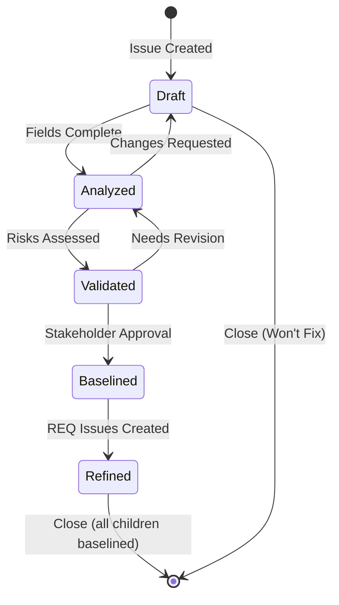
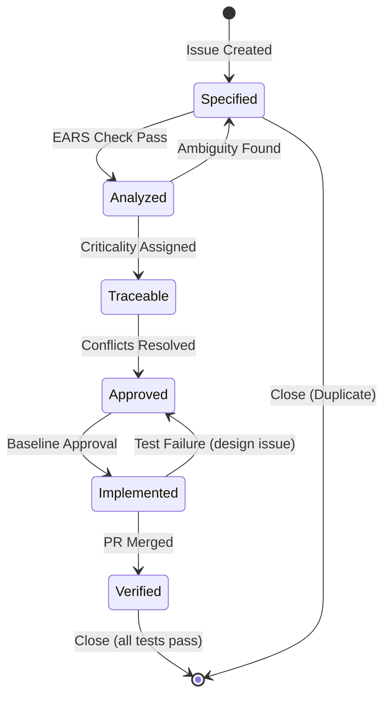
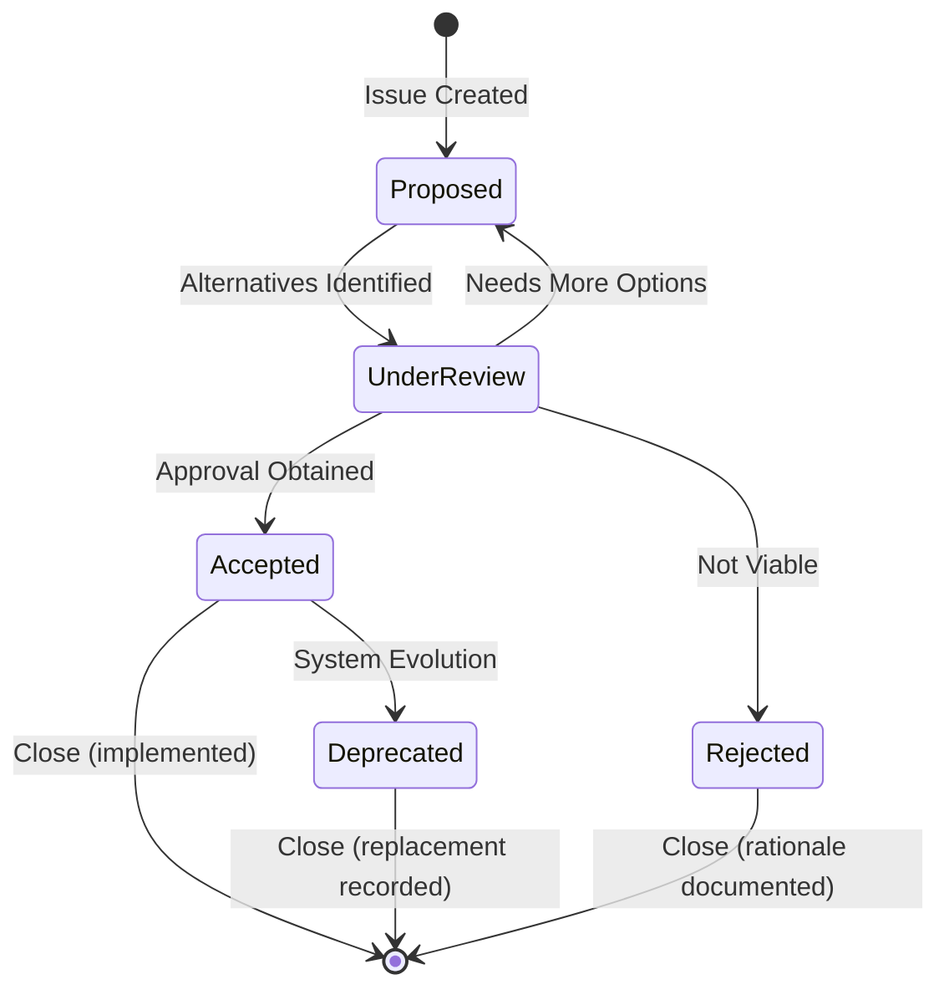
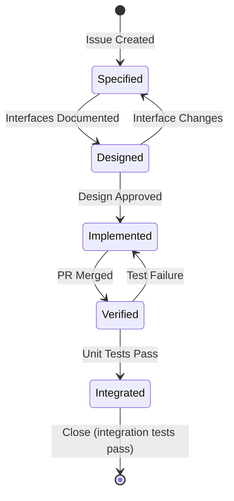

# GitHub Issue Status Management - ISO/IEC/IEEE Compliant

**Purpose**: Define detailed status workflows for systems engineering artifacts (StR, REQ, ADR, ADC) using GitHub Issues and Projects, aligned with ISO/IEC/IEEE standards.

**Standards**: 
- ISO/IEC/IEEE 12207:2017 (Configuration Status Accounting)
- ISO/IEC/IEEE 29148:2018 (Requirements Attributes)
- ISO/IEC/IEEE 42010:2011 (Architecture Decisions)
- IEEE 1012-2016 (Verification Status)

**Version**: 1.0  
**Last Updated**: 2025-12-09

---

## 🎯 Overview

This guide defines when to set issues to "In Work" (Open), when to close them, and what detailed states make sense for different artifact types throughout the software lifecycle.

### Key Principles

1. **Configuration Status Accounting**: Maintain status information for system elements and baselines to support decision-making (ISO/IEC/IEEE 12207)
2. **Requirements Attributes**: Track inclusion in baselines, verification status, and priority (ISO/IEC/IEEE 29148)
3. **Traceability**: Maintain bidirectional links between issues (StR ↔ REQ ↔ ADR ↔ ADC ↔ TEST)
4. **Custom Fields Over Labels**: Use GitHub Projects Custom Fields for detailed states while keeping simple Open/Closed states

---

## 📊 Implementation Strategy in GitHub

### Using GitHub Projects for Status Management

**Recommended Approach**:

1. **GitHub Issue State**: Keep simple Open/Closed
   - **Open**: Issue is active (Draft → Verified)
   - **Closed**: Issue is complete and baselined, or rejected/obsolete

2. **GitHub Projects Custom Fields**: Track detailed lifecycle states
   - Create **Single Select** custom field named **"Status"** or **"Stage"**
   - Define states specific to artifact type (see sections below)
   - Create Kanban board views with columns for each state

3. **Labels**: Use for categorization, not workflow states
   - `type:stakeholder-requirement`, `type:requirement:functional`, `type:architecture:decision`
   - `phase-01`, `phase-02`, `phase-03`
   - `priority-critical`, `priority-high`, `priority-medium`, `priority-low`

4. **Cross-Linking**: Maintain traceability via `#N` syntax
   - StR → REQ: `Refined by: #45, #46`
   - REQ → ADR: `Satisfied by: #78`
   - ADR → ADC: `Implements: #79`
   - REQ → TEST: `Verified by: #120`

---

## 1️⃣ Stakeholder Requirements (StR)

**ISO/IEC/IEEE 29148:2018 Process**: Stakeholder Needs and Requirements Definition

### When to Set "In Work" (Open)

- When you begin the **Stakeholder Needs and Requirements Definition** process
- Specifically when **identifying stakeholders** and **eliciting their needs**
- When documenting business justification and success criteria

### When to Close

**Close only when**: Requirement has been **Baselined (Approved)** and **Validated** (confirmed with stakeholders)

**Note**: Keep Open while requirement is active; use Custom Field "Status" to track detailed states

### Detailed States (GitHub Projects Custom Field)

Create a **"Status"** custom field with these values:

| State | Definition | Entry Criteria | Exit Criteria |
|-------|------------|----------------|---------------|
| **Draft** | Initial capture of stakeholder need | Issue created | All required fields completed |
| **Analyzed** | Need analyzed for feasibility, criticality, risk | Description complete | Feasibility confirmed, risks assessed |
| **Validated** | Stakeholders confirm this represents their need | Analysis complete | Stakeholder sign-off obtained |
| **Baselined** | Formally approved and under configuration control | Validated | Included in approved baseline document |
| **Refined** | Transformed into system requirements (Phase 02) | Baselined | Child REQ issues created and linked |

### Status Transitions



### Example Custom Field Values

```yaml
Status Options:
  - Draft
  - Analyzed (Criticality/Risk)
  - Validated (Stakeholder Approval)
  - Baselined (Configuration Control)
  - Refined (System Requirements Created)
```

### GitHub Issue Workflow

**Creating StR Issue**:
1. Navigate to Issues → New Issue
2. Select "Stakeholder Requirement (StR)" template
3. Complete all required fields
4. Apply labels: `type:stakeholder-requirement`, `phase-01`
5. **Set Status**: "Draft" (in GitHub Project)

**Updating StR Status**:
```markdown
## Status Update (2025-12-09)
**Previous Status**: Draft
**New Status**: Analyzed
**Rationale**: Completed feasibility study, identified high criticality (safety-related)
**Risk Assessment**: Medium technical risk due to third-party API dependency
**Next Steps**: Schedule validation session with stakeholders
```

**Closing StR Issue**:
```markdown
## Closure (2025-12-15)
**Status**: Baselined → Refined → Closed
**Baseline**: Release 1.0 Stakeholder Requirements Baseline (approved 2025-12-12)
**Refined By**: #45 (REQ-F-AUTH-001), #46 (REQ-NF-SECU-002)
**Validated By**: Maria Schmidt (EU CSM), Yuki Tanaka (APAC Sales)
**Configuration Control**: SRB-2025-001
```

---

## 2️⃣ System Requirements (REQ)

**ISO/IEC/IEEE 29148:2018 Process**: System Requirements Definition

### When to Set "In Work" (Open)

- When you begin **transforming stakeholder needs** into technical system requirements
- When defining the **functional boundary** of the system
- When allocating requirements to architectural elements

### When to Close

**Close only when**: Requirement has been **Approved/Baselined**, **Implemented**, and **Verified** (tests pass with objective evidence)

**Note**: Keep Open while requirement is active in system; use Custom Field for detailed tracking

### Detailed States (GitHub Projects Custom Field)

| State | Definition | Entry Criteria | Exit Criteria |
|-------|------------|----------------|---------------|
| **Specified** | Requirement written in clear, testable form | Derived from StR | Passes EARS template check |
| **Analyzed** | Checked for ambiguity, consistency, necessity | Specified | Criticality assigned, conflicts resolved |
| **Traceable** | Linked upward (StR) and downward (ADC) | Analyzed | All traceability links present |
| **Approved** | Formally approved and baselined | Traceable | Stakeholder/technical approval obtained |
| **Implemented** | Design and code completed | Approved | PR merged, code references REQ issue |
| **Verified** | Objective evidence confirms fulfillment | Implemented | All test cases pass (unit/integration/acceptance) |

### Status Transitions



### Example Custom Field Values

```yaml
Status Options:
  - Specified
  - Analyzed (Criticality Assigned)
  - Traceable (Links Verified)
  - Approved/Baselined
  - Implemented (Code Complete)
  - Verified (Tests Pass)
```

### GitHub Issue Workflow

**Creating REQ Issue**:
1. Navigate to Issues → New Issue
2. Select "Functional Requirement (REQ-F)" or "Non-Functional Requirement (REQ-NF)" template
3. Traces to:  Link parent StR issue using `#N`
4. Apply labels: `type:requirement:functional`, `phase-02`
5. **Set Status**: "Specified" (in GitHub Project)

**Updating REQ Status**:
```markdown
## Status Update (2025-12-10)
**Previous Status**: Specified
**New Status**: Analyzed
**Analysis Results**:
- Ambiguity check: PASS (clear EARS format)
- Consistency check: PASS (no conflicts with #46)
- Necessity check: PASS (traces to StR #1)
- Criticality: **High** (security-related, integrity level IL-3)
- Risk: Medium (third-party API dependency)

**Next Steps**: Add traceability links to architecture components
```

**Verification Evidence**:
```markdown
## Verification Complete (2025-12-18)
**Status**: Verified
**Test Cases**: #120 (PASS), #121 (PASS), #122 (PASS)
**Coverage**: 94% lines, 89% branches
**Acceptance Criteria**: All 5 scenarios passed
**Evidence**: 
- Unit tests: `src/tests/unit/auth/login.spec.ts` (15 tests, 100% pass)
- Integration tests: `src/tests/integration/auth.spec.ts` (8 tests, 100% pass)
- Manual verification: Staging deployment (2025-12-17)

**Verified By**: John Doe (QA Lead)
**Closure Recommendation**: Ready to close after deployment to production
```

---

## 3️⃣ Architecture Decision Records (ADR)

**ISO/IEC/IEEE 42010:2011 Process**: Architecture Definition

### When to Set "In Work" (Open)

- When an **architectural concern** is identified requiring a decision
- When **trade-off analysis** (e.g., ATAM) begins to evaluate design alternatives
- When analyzing **decision information** or synthesizing proposed solutions

### When to Close

**Close when**: Decision is **made and recorded** with full rationale, alternatives considered, and consequences documented (Accepted or Rejected)

### Detailed States (GitHub Projects Custom Field)

| State | Definition | Entry Criteria | Exit Criteria |
|-------|------------|----------------|---------------|
| **Proposed** | Decision under consideration | Issue created | Context and alternatives identified |
| **Under Review** | Evaluating against quality attributes | Alternatives documented | Trade-off analysis complete |
| **Accepted** | Decision approved and will be implemented | Review complete, stakeholder approval | Rationale documented, ADC issues created |
| **Rejected** | Decision discarded (rationale recorded) | Review complete | Reason for rejection documented |
| **Deprecated** | Previous decision no longer valid | System evolution | Replacement decision identified |

### Status Transitions



### Example Custom Field Values

```yaml
Status Options:
  - Proposed
  - Under Review (Trade-off Analysis)
  - Accepted (Approved for Implementation)
  - Rejected (Rationale Documented)
  - Deprecated/Obsolete
```

### GitHub Issue Workflow

**Creating ADR Issue**:
1. Navigate to Issues → New Issue
2. Select "Architecture Decision (ADR)" template
3. Traces to:  Link requirements using `#N`
4. Apply labels: `type:architecture:decision`, `phase-03`
5. **Set Status**: "Proposed" (in GitHub Project)

**Decision Review**:
```markdown
## Trade-off Analysis (2025-12-11)
**Status**: Under Review
**Quality Attribute Scenarios Evaluated**:
- QA-SC-001: Horizontal scalability (Redis cluster adds latency: -1 point)
- QA-SC-002: Offline capability (OAuth2 requires connectivity: -2 points)
- QA-SC-003: Security (All options meet requirements: 0 points)

**Alternatives Scoring**:
1. **JWT (recommended)**: +5 (stateless, scalable, offline support)
2. Session + Redis: +2 (familiar, revocable, but adds complexity)
3. OAuth2: 0 (external dependency, no offline)
4. API Keys: -3 (security risks)

**Recommendation**: Accept JWT approach with short-lived tokens + refresh mechanism
**Reviewers**: @tech-lead, @security-lead, @architect
```

**Acceptance**:
```markdown
## Decision Accepted (2025-12-12)
**Status**: Accepted → Close
**Approval**: Technical Review Board (2025-12-12)
**Rationale**: Best balance of scalability, security, and offline capability
**Consequences Acknowledged**:
- ✅ Positive: Stateless, horizontal scaling, microservices-friendly
- ❌ Negative: No immediate revocation (mitigated by short-lived tokens + blacklist)

**Implementation**:
- Architecture Components Created: #79 (ARC-C-AUTH)
- Implementation Issues: #85 (JWT generation), #86 (token validation)
- Test Issues: #120 (token lifecycle tests)

**Configuration Control**: ARB-2025-003
```

---

## 4️⃣ Architecture Design Components (ADC)

**ISO/IEC/IEEE 42010:2011 / IEEE 1016-2009**: Design Definition

### When to Set "In Work" (Open)

- When you **select an element** to refine during Design Definition process
- When **allocating requirements or responsibilities** to this specific component
- When defining interfaces between components

### When to Close

**Close when**: Component has been **Implemented** (coded), **Integrated**, and **Verified** (unit tested and integration tested)

### Detailed States (GitHub Projects Custom Field)

| State | Definition | Entry Criteria | Exit Criteria |
|-------|------------|----------------|---------------|
| **Specified** | Interfaces and responsibilities defined | Issue created | Interface contracts documented |
| **Designed** | Internal structure and algorithms defined | Interfaces specified | Detailed design complete (class diagrams, sequence diagrams) |
| **Implemented** | Code or artifact created | Design approved | PR merged, code references ADC issue |
| **Verified** | Unit tests and inspections passed | Implemented | White-box coverage achieved (>80%) |
| **Integrated** | Successfully combined with other components | Verified | Integration tests pass, interfaces validated |

### Status Transitions



### Example Custom Field Values

```yaml
Status Options:
  - Specified (Interfaces Defined)
  - Designed (Internal Structure Complete)
  - Implemented (Code Complete)
  - Verified (Unit Tests Pass)
  - Integrated (Integration Tests Pass)
```

### GitHub Issue Workflow

**Creating ADC Issue**:
1. Navigate to Issues → New Issue
2. Select "Architecture Component (ARC-C)" template
3. Traces to:  Link ADR and REQ issues using `#N`
4. Apply labels: `type:architecture:component`, `phase-03`
5. **Set Status**: "Specified" (in GitHub Project)

**Design Documentation**:
```markdown
## Design Complete (2025-12-13)
**Status**: Designed
**Design Artifacts**:
- Class Diagram: `04-design/components/auth-service.png`
- Sequence Diagrams: Login flow, logout flow, token refresh
- Interface Contracts: `IUserService`, `ITokenService`, `IPasswordHasher`
- Data Models: `User`, `Session`, `RefreshToken`
- Design Patterns: Repository (data access), Strategy (password hashing), Dependency Injection

**Design Review**: Approved by @tech-lead (2025-12-13)
**Next Steps**: Begin implementation (TDD approach)
```

**Verification Evidence**:
```markdown
## Unit Tests Complete (2025-12-16)
**Status**: Verified
**Test Results**:
- Unit tests: 22/22 passing (100%)
- Coverage: 92% lines, 88% branches, 95% functions
- White-box testing: All paths exercised
- Edge cases: Tested invalid inputs, boundary conditions, error handling

**Test Files**:
- `tests/unit/services/UserService.spec.ts` (12 tests)
- `tests/unit/services/TokenService.spec.ts` (6 tests)
- `tests/unit/utils/PasswordHasher.spec.ts` (4 tests)

**Verified By**: Developer self-test + peer review
**Next Steps**: Integration with database and API gateway
```

**Integration Complete**:
```markdown
## Integration Verified (2025-12-17)
**Status**: Integrated → Close
**Integration Points Validated**:
- ✅ UserService ↔ PostgreSQL Database (connection pool, transactions)
- ✅ UserService ↔ TokenService (JWT generation, validation)
- ✅ UserService ↔ PasswordHasher (bcrypt hashing)
- ✅ API Gateway ↔ UserService endpoints (routing, middleware)

**Integration Tests**: 8/8 passing (100%)
**End-to-End Tests**: 3/3 passing (login, logout, token refresh)

**Deployment**: Merged to develop, deployed to staging
**Configuration Control**: DRB-2025-005
```

---

## 📊 Summary: Status by Artifact Type

| Issue Type | Start "In Work" | Close When | Detailed States (Custom Fields) |
|------------|-----------------|------------|--------------------------------|
| **StR** (Stakeholder Requirement) | Elicitation starts | Baselined & Validated & Refined | `Draft`, `Analyzed (Criticality/Risk)`, `Validated (Stakeholder Approval)`, `Baselined (Config Control)`, `Refined (REQ Created)` |
| **REQ** (System Requirement) | Transformation starts | Approved & Implemented & Verified | `Specified`, `Analyzed (Criticality)`, `Traceable (Links)`, `Approved/Baselined`, `Implemented (Code)`, `Verified (Tests)` |
| **ADR** (Architecture Decision) | Trade-off analysis starts | Decision Finalized (Accepted/Rejected) | `Proposed`, `Under Review (Trade-off)`, `Accepted`, `Rejected`, `Deprecated` |
| **ADC** (Architecture Component) | Allocation starts | Integrated & Verified | `Specified (Interfaces)`, `Designed (Structure)`, `Implemented (Code)`, `Verified (Unit Tests)`, `Integrated (Integration Tests)` |

---

## 🔧 GitHub Projects Setup

### Step 1: Create Custom Field

1. Open your GitHub Project
2. Click **Settings** (⚙️)
3. Click **+ New field**
4. **Field type**: Single select
5. **Field name**: "Status"
6. **Options**: Add states from tables above (specific to artifact type)

### Step 2: Create Board Views

**Stakeholder Requirements Board**:
- Filter: `label:type:stakeholder-requirement`
- Group by: Status
- Columns: Draft → Analyzed → Validated → Baselined → Refined

**System Requirements Board**:
- Filter: `label:type:requirement:functional OR label:type:requirement:non-functional`
- Group by: Status
- Columns: Specified → Analyzed → Traceable → Approved → Implemented → Verified

**Architecture Decisions Board**:
- Filter: `label:type:architecture:decision`
- Group by: Status
- Columns: Proposed → Under Review → Accepted / Rejected

**Architecture Components Board**:
- Filter: `label:type:architecture:component`
- Group by: Status
- Columns: Specified → Designed → Implemented → Verified → Integrated

### Step 3: Configure Automations

**Auto-add Issues**:
- Enable built-in "Auto-add to project" workflow
- Filter: `is:issue is:open label:type:stakeholder-requirement OR label:type:requirement OR label:type:architecture`

**Auto-update Status** (via GitHub Actions - see below):
- When PR merged → Update status to "Implemented"
- When tests pass → Update status to "Verified"
- When issue closed → Archive or set final status

---

## 🤖 Automation via GitHub Actions

### Update Status on PR Merge

```yaml
name: Update Issue Status on PR Merge

on:
  pull_request:
    types: [closed]

jobs:
  update-status:
    if: github.event.pull_request.merged == true
    runs-on: ubuntu-latest
    permissions:
      issues: write
      contents: read
    
    steps:
      - name: Update implemented requirements to "Implemented"
        uses: actions/github-script@v7
        with:
          script: |
            const body = context.payload.pull_request.body || '';
            const issueNumbers = [...body.matchAll(/(?:Fixes|Implements|Closes)\s+#(\d+)/gi)]
              .map(m => parseInt(m[1]));
            
            for (const issueNum of issueNumbers) {
              try {
                // Get issue details
                const issue = await github.rest.issues.get({
                  owner: context.repo.owner,
                  repo: context.repo.repo,
                  issue_number: issueNum
                });
                
                // Add comment with status update
                await github.rest.issues.createComment({
                  owner: context.repo.owner,
                  repo: context.repo.repo,
                  issue_number: issueNum,
                  body: `✅ PR #${context.payload.pull_request.number} merged.\n\n**Status Update**: Implemented (Code Complete)\n**Next Step**: Verify via tests (move to "Verified" status after CI passes)`
                });
                
                console.log(`Updated issue #${issueNum} status to Implemented`);
              } catch (error) {
                console.log(`Could not update issue #${issueNum}: ${error.message}`);
              }
            }
```

### Update Status on Test Pass

```yaml
name: Update Issue Status on Tests Pass

on:
  push:
    branches: [master, main, develop]

jobs:
  test-and-update:
    runs-on: ubuntu-latest
    permissions:
      issues: write
      contents: read
    
    steps:
      - uses: actions/checkout@v4
      
      - name: Run tests
        run: npm test
      
      - name: Update verified issues
        if: success()
        uses: actions/github-script@v7
        with:
          script: |
            // Find all issues mentioned in recent commits
            const commits = await github.rest.repos.listCommits({
              owner: context.repo.owner,
              repo: context.repo.repo,
              sha: context.sha,
              per_page: 10
            });
            
            const issueNumbers = new Set();
            for (const commit of commits.data) {
              const matches = commit.commit.message.matchAll(/#(\d+)/g);
              for (const match of matches) {
                issueNumbers.add(parseInt(match[1]));
              }
            }
            
            for (const issueNum of issueNumbers) {
              try {
                await github.rest.issues.createComment({
                  owner: context.repo.owner,
                  repo: context.repo.repo,
                  issue_number: issueNum,
                  body: `✅ All tests passed for commit ${context.sha.substring(0, 7)}.\n\n**Status Update**: Verified (Tests Pass)\n**Next Step**: Integration testing or deployment`
                });
              } catch (error) {
                console.log(`Could not update issue #${issueNum}: ${error.message}`);
              }
            }
```

---

## ✅ Best Practices

### Always Do
✅ Use GitHub Projects Custom Fields for detailed states (not labels)  
✅ Keep GitHub Issue state simple (Open vs. Closed)  
✅ Update status in issue comments with rationale and next steps  
✅ Maintain traceability links when status changes  
✅ Close issues only when fully complete and baselined  
✅ Document evidence for status transitions (test results, approvals)  
✅ Use automation to reduce manual status updates  

### Never Do
❌ Use status labels for workflow states (use Custom Fields instead)  
❌ Close issues prematurely (before verification complete)  
❌ Skip status updates when making changes  
❌ Forget to document rationale for status changes  
❌ Move to "Implemented" without PR link  
❌ Move to "Verified" without test evidence  
❌ Leave issues in intermediate states for >7 days without updates  

---

## 🔗 Related Documentation

- [GitHub Issue Workflow](github-issue-workflow.md) - Basic issue management
- [Root Copilot Instructions](../.github/copilot-instructions.md) - Issue-driven development
- [Lifecycle Guide](lifecycle-guide.md) - Phase-specific workflows
- [Phase 01 Instructions](../.github/instructions/phase-01-stakeholder-requirements.instructions.md) - StR workflow
- [Phase 02 Instructions](../.github/instructions/phase-02-requirements.instructions.md) - REQ workflow
- [Phase 03 Instructions](../.github/instructions/phase-03-architecture.instructions.md) - ADR/ADC workflow

---

**Version**: 1.0  
**Last Updated**: 2025-12-09  
**Maintained By**: Standards Compliance Team
