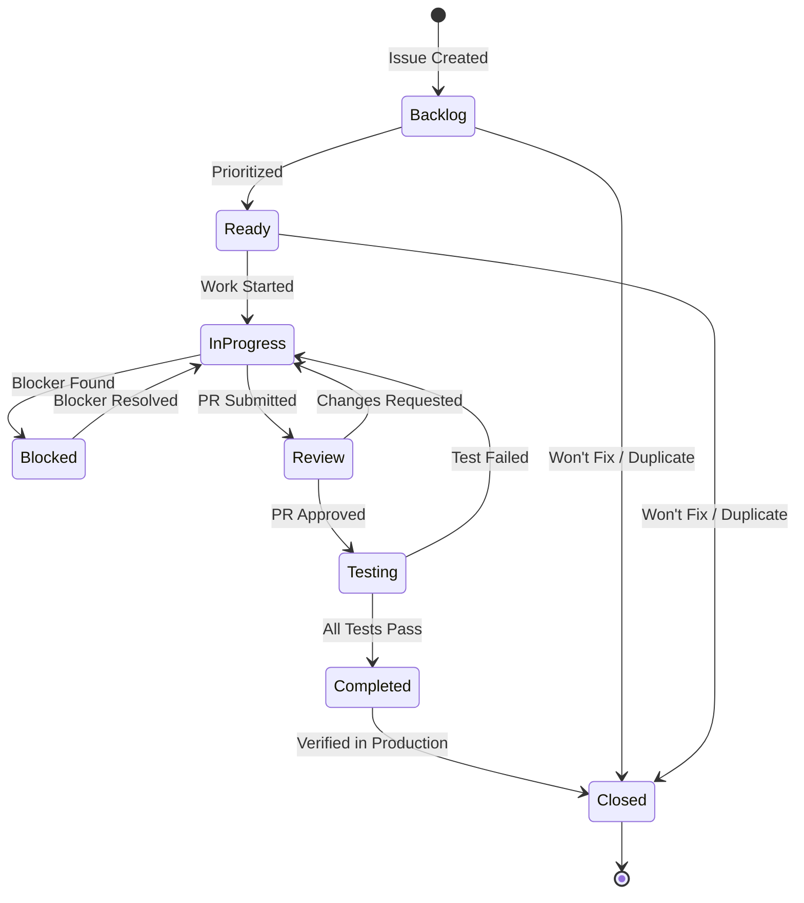

# GitHub Issue Workflow - Status Management and Automation

**Purpose**: Define how GitHub Issues are managed throughout the software development lifecycle, including status transitions, automation, and integration with GitHub MCP tools.

**Standards**: ISO/IEC/IEEE 12207:2017 (Configuration Management), ISO/IEC/IEEE 29148:2018 (Requirements Management)

## 🚀 Quick Start: Setting Up Your Workflow

### What Can Be Automated vs. Manual Setup

| Task | Can Be Automated? | How |
|------|-------------------|-----|
| **Create status labels** | ✅ Yes (via GitHub Actions) | Run workflow on first push |
| **Create GitHub Project** | ❌ No (requires manual setup) | One-time UI configuration |
| **Auto-add issues to project** | ✅ Yes (built-in) | Enable GitHub Projects auto-add workflow |
| **Update issue status** | ✅ Yes (via MCP/Actions) | Copilot MCP tools + GitHub Actions |
| **Move issues between columns** | ✅ Yes (built-in) | Automatic based on label changes |
| **Close issues after CI** | ✅ Yes (via Actions) | GitHub Actions workflow |

### Initial Setup Steps

**One-Time Manual Setup** (5-10 minutes):

1. **Create GitHub Project** (Manual - see [GitHub Projects Integration](#github-projects-integration))
   - Create board with status columns
   - Enable auto-add workflow for new issues
   - Configure built-in automations

**Automated Setup** (First CI run):

2. **Status Labels** (Automated - via GitHub Actions)
   - Labels are created automatically on first workflow run
   - See [Label Creation Workflow](#label-creation-workflow)

3. **Issue Status Updates** (Automated - via MCP/Actions)
   - Copilot can update status via MCP tools
   - GitHub Actions auto-updates on events
   - See [Automated Status Updates](#automated-status-updates-via-github-actions)

## 📋 Issue Status Workflow

### Overview: Generic vs. Artifact-Specific Status

This guide covers **generic workflow states** for general development tasks. For **systems engineering artifacts** (StR, REQ, ADR, ADC) that require ISO/IEC/IEEE standards compliance, see the comprehensive [GitHub Issue Status Management Guide](github-issue-status-management.md).

**When to use which guide**:
- **This guide (github-issue-workflow.md)**: General development tasks, bugs, features, spikes
- **[Status Management Guide](github-issue-status-management.md)**: Stakeholder Requirements (StR), System Requirements (REQ), Architecture Decisions (ADR), Architecture Components (ADC)

### Issue States and Lifecycle (Generic Workflow)

GitHub provides two primary states: **Open** and **Closed**. We extend these with labels to track detailed status:

| Status Label | Meaning | When to Apply |
|--------------|---------|---------------|
| `status:backlog` | Issue created but not yet prioritized | Initial creation |
| `status:ready` | Prioritized and ready for work | After sprint planning |
| `status:in-progress` | Actively being worked on | When work begins |
| `status:review` | Implementation complete, awaiting review | PR submitted |
| `status:testing` | In verification/validation phase | Tests being executed |
| `status:blocked` | Work stopped due to dependency or issue | When blocker identified |
| `status:completed` | Fully implemented and verified | When PR merged and verified |
| `status:closed` | Issue closed (completed, duplicate, or won't fix) | Final closure |

**Note**: For systems engineering artifacts (StR, REQ, ADR, ADC), use **GitHub Projects Custom Fields** with artifact-specific states instead of these generic labels. See [Status Management Guide](github-issue-status-management.md) for details.

### State Transitions



## 🤖 Using GitHub MCP to Manage Issue Status

### Tool: `mcp_io_github_git_issue_write`

**Purpose**: Create or update GitHub issues, including status changes.

**Parameters**:
```typescript
{
  method: 'create' | 'update',
  owner: string,          // Repository owner (e.g., 'zarfld')
  repo: string,           // Repository name (e.g., 'copilot-instructions-template')
  issue_number?: number,  // Required for 'update'
  title?: string,
  body?: string,
  state?: 'open' | 'closed',
  state_reason?: 'completed' | 'not_planned' | 'duplicate',
  labels?: string[],      // Add/update labels including status labels
  assignees?: string[],   // Assign users
  milestone?: number
}
```

### Common Status Update Scenarios

#### 1. Start Work on an Issue (Open → In Progress)

```python
# User starts work on REQ-F-AUTH-001 (Issue #123)
mcp_io_github_git_issue_write(
    method='update',
    owner='zarfld',
    repo='copilot-instructions-template',
    issue_number=123,
    labels=['type:requirement:functional', 'status:in-progress', 'priority:p0'],
    assignees=['zarfld']  # Assign to yourself
)
```

**Best Practice**: Always assign yourself when moving to `status:in-progress`.

#### 2. Submit PR (In Progress → Review)

```python
# After creating PR #45 for Issue #123
mcp_io_github_git_issue_write(
    method='update',
    owner='zarfld',
    repo='copilot-instructions-template',
    issue_number=123,
    labels=['type:requirement:functional', 'status:review', 'priority:p0']
)

# Add comment linking to PR
mcp_io_github_git_add_issue_comment(
    owner='zarfld',
    repo='copilot-instructions-template',
    issue_number=123,
    body='Implementation complete. See PR #45 for review.'
)
```

#### 3. Tests Pass (Testing → Completed)

```python
# After all tests pass
mcp_io_github_git_issue_write(
    method='update',
    owner='zarfld',
    repo='copilot-instructions-template',
    issue_number=123,
    labels=['type:requirement:functional', 'status:completed', 'priority:p0']
)

mcp_io_github_git_add_issue_comment(
    owner='zarfld',
    repo='copilot-instructions-template',
    issue_number=123,
    body='✅ All tests passed. Implementation verified. Closing issue.\n\nVerified by: #89, #90'
)
```

#### 4. Close Issue (Completed → Closed)

```python
# Close with 'completed' reason
mcp_io_github_git_issue_write(
    method='update',
    owner='zarfld',
    repo='copilot-instructions-template',
    issue_number=123,
    state='closed',
    state_reason='completed',  # Options: 'completed', 'not_planned', 'duplicate'
    labels=['type:requirement:functional', 'status:closed', 'priority:p0']
)
```

#### 5. Mark as Blocked

```python
# Issue blocked waiting for dependency #45
mcp_io_github_git_issue_write(
    method='update',
    owner='zarfld',
    repo='copilot-instructions-template',
    issue_number=123,
    labels=['type:requirement:functional', 'status:blocked', 'priority:p0']
)

mcp_io_github_git_add_issue_comment(
    owner='zarfld',
    repo='copilot-instructions-template',
    issue_number=123,
    body='⚠️ **Blocked**: Waiting for #45 (ADR-SECU-001: JWT Authentication) to be completed.'
)
```

## 🔄 Automated Status Updates via GitHub Actions

### Label Creation Workflow

Create status labels automatically on first run. Add to `.github/workflows/setup-labels.yml`:

```yaml
name: Setup Status Labels

on:
  workflow_dispatch:  # Manual trigger
  push:
    branches: [master, main]
    paths:
      - '.github/workflows/setup-labels.yml'

jobs:
  create-labels:
    runs-on: ubuntu-latest
    permissions:
      issues: write
    
    steps:
      - name: Create status labels
        uses: actions/github-script@v7
        with:
          script: |
            const labels = [
              { name: 'status:backlog', color: 'd4c5f9', description: 'Issue in backlog, not yet prioritized' },
              { name: 'status:ready', color: '0e8a16', description: 'Ready for development' },
              { name: 'status:in-progress', color: 'fbca04', description: 'Currently being worked on' },
              { name: 'status:review', color: 'ff9800', description: 'In code review' },
              { name: 'status:testing', color: '1d76db', description: 'In testing phase' },
              { name: 'status:blocked', color: 'b60205', description: 'Blocked by dependency or issue' },
              { name: 'status:completed', color: '0e8a16', description: 'Implementation complete and verified' },
              { name: 'status:closed', color: '6e7781', description: 'Issue closed' },
            ];
            
            for (const label of labels) {
              try {
                await github.rest.issues.createLabel({
                  owner: context.repo.owner,
                  repo: context.repo.repo,
                  name: label.name,
                  color: label.color,
                  description: label.description
                });
                console.log(`✅ Created label: ${label.name}`);
              } catch (error) {
                if (error.status === 422) {
                  console.log(`⏭️  Label already exists: ${label.name}`);
                } else {
                  console.error(`❌ Failed to create label ${label.name}:`, error.message);
                }
              }
            }
```

### Workflow: Auto-Update Issue Status

Create `.github/workflows/issue-status-automation.yml`:

```yaml
name: Issue Status Automation

on:
  pull_request:
    types: [opened, closed, reopened]
  issues:
    types: [assigned, unassigned]

jobs:
  update-issue-status:
    runs-on: ubuntu-latest
    permissions:
      issues: write
      pull-requests: read
    
    steps:
      - name: Update status when assigned
        if: github.event_name == 'issues' && github.event.action == 'assigned'
        uses: actions/github-script@v7
        with:
          script: |
            // Get current labels
            const issue = await github.rest.issues.get({
              owner: context.repo.owner,
              repo: context.repo.repo,
              issue_number: context.issue.number
            });
            
            // Remove old status labels and add 'in-progress'
            const labels = issue.data.labels
              .map(l => l.name)
              .filter(l => !l.startsWith('status:'));
            
            labels.push('status:in-progress');
            
            await github.rest.issues.update({
              owner: context.repo.owner,
              repo: context.repo.repo,
              issue_number: context.issue.number,
              labels: labels
            });
            
            await github.rest.issues.createComment({
              owner: context.repo.owner,
              repo: context.repo.repo,
              issue_number: context.issue.number,
              body: '🚀 Issue moved to **In Progress** (assigned to @' + context.payload.assignee.login + ')'
            });
      
      - name: Update status when PR opened
        if: github.event_name == 'pull_request' && github.event.action == 'opened'
        uses: actions/github-script@v7
        with:
          script: |
            // Extract issue numbers from PR body
            const body = context.payload.pull_request.body || '';
            const issueNumbers = [...body.matchAll(/#(\d+)/g)].map(m => parseInt(m[1]));
            
            for (const issueNum of issueNumbers) {
              try {
                const issue = await github.rest.issues.get({
                  owner: context.repo.owner,
                  repo: context.repo.repo,
                  issue_number: issueNum
                });
                
                // Update to 'review' status
                const labels = issue.data.labels
                  .map(l => l.name)
                  .filter(l => !l.startsWith('status:'));
                
                labels.push('status:review');
                
                await github.rest.issues.update({
                  owner: context.repo.owner,
                  repo: context.repo.repo,
                  issue_number: issueNum,
                  labels: labels
                });
                
                await github.rest.issues.createComment({
                  owner: context.repo.owner,
                  repo: context.repo.repo,
                  issue_number: issueNum,
                  body: '🔍 PR #' + context.payload.pull_request.number + ' opened for review.'
                });
              } catch (error) {
                console.log(`Could not update issue #${issueNum}: ${error.message}`);
              }
            }
      
      - name: Update status when PR merged
        if: github.event_name == 'pull_request' && github.event.pull_request.merged == true
        uses: actions/github-script@v7
        with:
          script: |
            // Extract issue numbers from PR body
            const body = context.payload.pull_request.body || '';
            const issueNumbers = [...body.matchAll(/(?:Fixes|Closes|Resolves|Implements)\s+#(\d+)/gi)]
              .map(m => parseInt(m[1]));
            
            for (const issueNum of issueNumbers) {
              try {
                const issue = await github.rest.issues.get({
                  owner: context.repo.owner,
                  repo: context.repo.repo,
                  issue_number: issueNum
                });
                
                // Update to 'testing' status (don't close yet, wait for verification)
                const labels = issue.data.labels
                  .map(l => l.name)
                  .filter(l => !l.startsWith('status:'));
                
                labels.push('status:testing');
                
                await github.rest.issues.update({
                  owner: context.repo.owner,
                  repo: context.repo.repo,
                  issue_number: issueNum,
                  labels: labels
                });
                
                await github.rest.issues.createComment({
                  owner: context.repo.owner,
                  repo: context.repo.repo,
                  issue_number: issueNum,
                  body: '✅ PR #' + context.payload.pull_request.number + ' merged. Moving to testing phase.'
                });
              } catch (error) {
                console.log(`Could not update issue #${issueNum}: ${error.message}`);
              }
            }
```

### Workflow: Close Issues After CI Success

Add to `.github/workflows/ci-standards-compliance.yml`:

```yaml
  close-completed-issues:
    name: Close Completed Issues
    runs-on: ubuntu-latest
    needs: [compliance-report]  # Run after all tests pass
    if: github.event_name == 'push' && github.ref == 'refs/heads/master'
    permissions:
      issues: write
    
    steps:
      - name: Close issues in testing status
        uses: actions/github-script@v7
        with:
          script: |
            // Find all issues with 'status:testing'
            const issues = await github.rest.issues.listForRepo({
              owner: context.repo.owner,
              repo: context.repo.repo,
              state: 'open',
              labels: 'status:testing',
              per_page: 100
            });
            
            for (const issue of issues.data) {
              // Update to completed and close
              const labels = issue.labels
                .map(l => l.name)
                .filter(l => !l.startsWith('status:'));
              
              labels.push('status:completed');
              
              await github.rest.issues.update({
                owner: context.repo.owner,
                repo: context.repo.repo,
                issue_number: issue.number,
                state: 'closed',
                state_reason: 'completed',
                labels: labels
              });
              
              await github.rest.issues.createComment({
                owner: context.repo.owner,
                repo: context.repo.repo,
                issue_number: issue.number,
                body: '✅ All CI checks passed. Issue completed and closed.\n\nCommit: ' + context.sha.substring(0, 7)
              });
            }
```

## 🎯 GitHub Copilot Agent Integration

### When to Update Issue Status Automatically

Copilot can suggest or perform status updates when:

1. **User assigns themselves to an issue** → Suggest moving to `status:in-progress`
2. **User creates a PR** → Suggest moving linked issues to `status:review`
3. **PR is merged** → Suggest moving to `status:testing`
4. **All tests pass** → Suggest closing with `status:completed`
5. **User mentions a blocker** → Suggest marking as `status:blocked`

### Example Copilot Workflow

```markdown
User: "I'm starting work on issue #123"

Copilot: "I'll update the issue status to in-progress and assign it to you."

[Copilot executes]
mcp_io_github_git_issue_write(
    method='update',
    issue_number=123,
    labels=['type:requirement:functional', 'status:in-progress', 'priority:p0'],
    assignees=['zarfld']
)

Copilot: "✅ Issue #123 is now In Progress and assigned to you. What would you like to implement first?"
```

## 📊 Status Tracking and Metrics

### Query Issues by Status

```bash
# List all in-progress issues
gh issue list --label "status:in-progress"

# List blocked issues
gh issue list --label "status:blocked"

# List issues ready for work
gh issue list --label "status:ready" --assignee "@me"
```

### GitHub Projects Integration

GitHub Projects provides **built-in automation** to automatically add issues and move them between columns based on status labels.

#### Setting Up GitHub Projects (One-Time Manual Setup)

**⚠️ Note**: GitHub Projects setup requires manual UI interaction (cannot be done via prompts/API currently).

**Steps**:

1. **Create Project**:
   - Go to repository → **Projects** tab → **New project**
   - Choose **Board** template
   - Name: "Standards-Compliant Development"

2. **Configure Columns** (matching status labels):
   - **Backlog** → Filter: `status:backlog`
   - **Ready** → Filter: `status:ready`
   - **In Progress** → Filter: `status:in-progress`
   - **Review** → Filter: `status:review`
   - **Testing** → Filter: `status:testing`
   - **Done** → Filter: `status:completed`

3. **Enable Built-in Auto-Add Workflow**:
   - Click **⋮** (menu) → **Workflows**
   - Select **Auto-add to project**
   - Click **Edit**
   - Set **Repository**: Your repository
   - Set **Filter**: `is:issue is:open` (adds all new open issues)
   - Click **Save and turn on workflow**
   - ⚠️ **Note**: This only adds **future** issues, not existing ones

4. **Import Existing Issues** (see [Importing Existing Issues](#importing-existing-issues) below)

5. **Enable Built-in Auto-Move Workflows**:
   - **Item closed** → Move to "Done"
   - **Item reopened** → Move to "Backlog"
   - **Pull request merged** → Move linked issues to "Testing"

#### Automated Behavior (After Setup)

Once configured, GitHub Projects **automatically**:

✅ **New issues** → Added to project (via auto-add workflow)  
✅ **Label changes** → Issues move between columns (e.g., add `status:in-progress` → moves to "In Progress")  
✅ **Issue closed** → Moves to "Done"  
✅ **Issue reopened** → Moves to "Backlog"  
✅ **PR merged** → Linked issues move to "Testing"  

#### GitHub Actions Integration (Optional Enhancement)

Add custom automation via GitHub Actions (`.github/workflows/project-automation.yml`):

```yaml
name: GitHub Projects Automation

on:
  issues:
    types: [opened, labeled, unlabeled, closed, reopened]
  pull_request:
    types: [opened, closed]

jobs:
  update-project-status:
    runs-on: ubuntu-latest
    permissions:
      issues: write
      contents: read
    
    steps:
      - name: Add issue to project
        if: github.event_name == 'issues' && github.event.action == 'opened'
        uses: actions/add-to-project@v0.5.0
        with:
          project-url: https://github.com/users/zarfld/projects/1  # Update with your project URL
          github-token: ${{ secrets.PAT_TOKEN }}  # Requires PAT with project scope
      
      - name: Update project item status based on labels
        if: github.event_name == 'issues' && (github.event.action == 'labeled' || github.event.action == 'unlabeled')
        uses: actions/github-script@v7
        with:
          script: |
            // This would require GraphQL API calls to update project item status
            // GitHub's built-in workflows handle this automatically
            console.log('Status updates handled by built-in project workflows');
```

**Note**: For advanced automation, GitHub's built-in workflows are simpler and more reliable than custom Actions.

### Importing Existing Issues

The auto-add workflow only adds **new** issues created after it's enabled. To import existing issues, use one of these methods:

#### Method 1: Bulk Add from Project (Recommended - Fastest)

1. **Open your project** → Click **+** at bottom of any column
2. **Click** "Add item from repository"
3. **Select repository** from dropdown
4. **Use filters** to find issues:
   - `is:open` - All open issues
   - `is:open label:bug` - Open bugs only
   - `is:open assignee:@me` - Your issues
   - `-label:duplicate` - Exclude duplicates
5. **Select all issues** (checkbox at top) or individual issues
6. **Click** "Add selected items"

**Limits**: Can add up to 50 items at once (repeat if needed)

#### Method 2: Bulk Add from Repository Issues Page

1. **Navigate to repository** → **Issues** tab
2. **Filter issues** using GitHub search:
   - `is:open` - All open issues
   - `is:open label:type:requirement` - All requirements
   - `is:open no:project` - Issues not in any project
3. **Select issues** (checkbox on left, or "Select all" at top)
4. **Click** "Projects" button above issue list
5. **Select your project** from dropdown

**Limits**: Can select all issues on current page (up to 25 per page)

#### Method 3: Add from Individual Issues

For specific issues:

1. **Open the issue** you want to add
2. **Right sidebar** → Click "Projects"
3. **Select your project** from dropdown
4. **Populate custom fields** (optional)

#### Method 4: Using Command Palette (Power Users)

1. **Open project** → Press `Cmd+K` (Mac) or `Ctrl+K` (Windows)
2. **Type** "Add items" → Press Enter
3. **Select repository** and use filters
4. **Select issues** → Click "Add selected items"

#### Bulk Import Script (For 100+ Issues)

For repositories with many issues, use GitHub CLI:

```bash
# Install GitHub CLI: https://cli.github.com/

# Get your project ID
gh project list --owner zarfld

# List all project items (to verify)
gh project item-list 1 --owner zarfld  # Replace 1 with your project number

# Bulk add all open issues (requires project URL)
gh issue list --repo zarfld/copilot-instructions-template --state open --limit 1000 --json number --jq '.[].number' | while read issue; do
  gh project item-add 1 --owner zarfld --url "https://github.com/zarfld/copilot-instructions-template/issues/$issue"
done
```

**Note**: Replace `zarfld` and `copilot-instructions-template` with your repository details.

#### Verification

After importing, verify issues were added:

1. **Project view** → Check issue count at bottom
2. **Group by Status** → Ensure issues appear in correct columns
3. **Filter by repository** → Confirm all issues imported

**Expected Behavior**: Issues with status labels automatically move to matching columns.

## ✅ Best Practices

### Always Do
✅ Update status when starting work (assign + `status:in-progress`)  
✅ Link PRs to issues with `Fixes #N` or `Implements #N`  
✅ Add comments when changing status to blocked  
✅ Verify tests before closing issues  
✅ Use `state_reason: 'completed'` when closing successfully implemented issues  
✅ Keep status labels synchronized with actual work state  

### Never Do
❌ Start work without assigning yourself  
❌ Close issues without verification  
❌ Leave issues in `status:in-progress` for >3 days without updates  
❌ Forget to link PRs to issues  
❌ Mix multiple unrelated fixes in one PR  
❌ Close issues with `state_reason: 'not_planned'` without explanation  

## 🔗 Integration with Traceability

Status updates should trigger traceability checks:

- **Moving to Review** → Validate all traceability links present
- **Moving to Testing** → Ensure TEST issues exist and link back
- **Moving to Completed** → Verify bidirectional traceability complete
- **Closing** → Generate traceability report and archive

## 📚 Related Documentation

### Core Status Management
- **[GitHub Issue Status Management Guide](github-issue-status-management.md)** - Comprehensive ISO/IEC/IEEE-compliant status workflows for StR, REQ, ADR, ADC artifacts

### Phase-Specific Workflows
- [Phase 01 Instructions](../.github/instructions/phase-01-stakeholder-requirements.instructions.md) - StR status workflow
- [Phase 02 Instructions](../.github/instructions/phase-02-requirements.instructions.md) - REQ status workflow  
- [Phase 03 Instructions](../.github/instructions/phase-03-architecture.instructions.md) - ADR/ADC status workflow

### General Documentation
- [CI/CD Workflows](ci-cd-workflows.md) - Automated traceability checks
- [Root Copilot Instructions](../.github/copilot-instructions.md) - Issue-driven development
- [Lifecycle Guide](lifecycle-guide.md) - Phase-specific issue workflows
- [GitHub Issues Traceability](../docs/improvement_ideas/using_github_issues_as_infrastructure_for_REQ_Tracability.md) - Detailed traceability patterns

---

**Version**: 1.1  
**Last Updated**: 2025-12-09  
**Maintained By**: Standards Compliance Team
