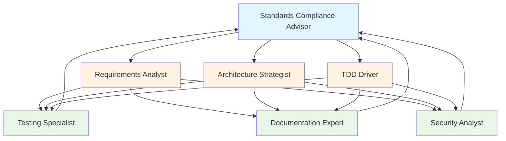

# Specialized Support Agents Implementation Summary

**Date**: 2025-01-23  
**Status**: ✅ Complete  
**Commits**: `93c4102`, `35e9673`

## Overview

This document summarizes the implementation of 3 specialized support agents that complement the existing lifecycle phase agents, providing comprehensive coverage of software development activities.

## Implemented Agents

### 1. Testing Specialist (`.github/agents/testing-specialist.md`)

**Purpose**: Test quality and coverage specialist

**Key Features**:
- **Boundary**: Write-only access to `tests/` directory
- **Test Types**: Unit (<10ms), Integration (100-500ms), E2E (1-5s)
- **Frameworks**: Jest, Mocha, Vitest, Playwright, Cypress, pytest, JUnit, Mockito
- **Coverage Analysis**: Identifies untested code paths, generates missing tests
- **Test Patterns**: AAA pattern (Arrange-Act-Assert), test data builders, parameterized tests
- **Quality Standards**: >80% coverage overall, >95% for critical paths
- **Matchers**: Comprehensive examples for common assertions

**Example Capabilities**:
```typescript
// Generate parameterized tests
describe('User validation', () => {
  test.each([
    { input: '', expected: false },
    { input: 'user@example.com', expected: true },
    { input: 'invalid', expected: false }
  ])('validates email $input', ({ input, expected }) => {
    expect(validateEmail(input)).toBe(expected);
  });
});
```

**Use Cases**:
- "Analyze coverage and generate tests for untested code paths"
- "Review these tests and suggest improvements following AAA pattern"
- "Generate parameterized tests for this function with edge cases"
- "Create integration tests for the authentication service"

---

### 2. Documentation Expert (`.github/agents/documentation-expert.md`)

**Purpose**: Technical writing and documentation specialist

**Key Features**:
- **Boundary**: Read-only `src/`, write-only `docs/`
- **API Documentation**: OpenAPI/Swagger specs, endpoint documentation with examples
- **User Guides**: Getting-started guides, tutorials, troubleshooting
- **Architecture Docs**: ADR template (300+ lines) with context, alternatives, rationale, consequences
- **Code Documentation**: JSDoc/TSDoc with `@param`, `@returns`, `@example`, `@implements`, `@architecture`
- **Quality Standards**: Readability, completeness, accuracy, accessibility
- **Templates**: API reference, user guide, ADR, code comments

**Example Capabilities**:
```typescript
/**
 * Authenticates a user with email and password.
 * 
 * @implements #123 REQ-F-AUTH-001: User Login
 * @architecture #45 ADR-SECU-001: JWT Authentication
 * 
 * @param credentials - User login credentials
 * @param credentials.email - User's email address
 * @param credentials.password - User's password (plain text)
 * @returns Promise resolving to authenticated user with JWT token
 * @throws {AuthenticationError} If credentials are invalid
 * @throws {RateLimitError} If too many login attempts
 * 
 * @example
 * ```typescript
 * const user = await authenticateUser({
 *   email: 'user@example.com',
 *   password: 'securePassword123'
 * });
 * console.log(user.token); // JWT token
 * ```
 */
export async function authenticateUser(
  credentials: LoginCredentials
): Promise<AuthenticatedUser> {
  // Implementation
}
```

**Use Cases**:
- "Generate API documentation for AuthService with all public methods"
- "Create a getting-started guide for new developers"
- "Document this architecture decision with alternatives and rationale"
- "Write JSDoc comments for this class with usage examples"

---

### 3. Security Analyst (`.github/agents/security-analyst.md`)

**Purpose**: Vulnerability detection and security risk analysis

**Key Features**:
- **Standards**: OWASP Top 10, CWE (Common Weakness Enumeration), CVE scanning
- **Vulnerability Detection**: SQL injection, XSS, CSRF, hardcoded secrets, weak hashing, missing authorization
- **Threat Modeling**: STRIDE framework (Spoofing, Tampering, Repudiation, Information Disclosure, DoS, Privilege Escalation)
- **Dependency Security**: CVE scanning with npm audit, Snyk, OWASP Dependency Check
- **Finding Format**: Severity (Critical/High/Medium/Low), CWE, impact, mitigation, references
- **Secure Coding Checklist**: Authentication, input validation, data protection, error handling, security headers

**Example Capabilities**:

**OWASP Top 10 Coverage**:
| OWASP ID | Vulnerability | Detection | Mitigation |
|----------|--------------|-----------|------------|
| A01:2021 | Broken Access Control | Check for missing auth checks | Implement role-based access control |
| A02:2021 | Cryptographic Failures | Detect weak hashing, plaintext secrets | Use bcrypt/Argon2, encrypt sensitive data |
| A03:2021 | Injection | SQL injection, command injection | Parameterized queries, input validation |
| A07:2021 | Authentication Failures | Weak password policies, no MFA | Enforce strong passwords, implement MFA |
| A08:2021 | Software/Data Integrity | Unsigned packages, no integrity checks | Verify signatures, use SRI |

**Example Finding**:
```markdown
### Finding: SQL Injection Vulnerability

**Severity**: Critical  
**CWE**: CWE-89 (SQL Injection)  
**Location**: `src/database/user-repository.ts:45`

**Vulnerable Code**:
```typescript
const query = `SELECT * FROM users WHERE email = '${email}'`;
const result = await db.query(query);
```

**Issue**: User input directly concatenated into SQL query, allowing SQL injection attacks.

**Impact**:
- Unauthorized data access (read entire database)
- Data modification or deletion
- Authentication bypass

**Mitigation**:
```typescript
const query = 'SELECT * FROM users WHERE email = $1';
const result = await db.query(query, [email]);
```

**References**:
- OWASP Top 10 A03:2021 - Injection
- CWE-89: SQL Injection
- MITRE ATT&CK: T1190 (Exploit Public-Facing Application)
```

**Use Cases**:
- "Scan this code for SQL injection vulnerabilities"
- "Review authentication implementation for security issues"
- "Generate threat model for user authentication using STRIDE"
- "Check for hardcoded secrets and weak password hashing"

---

## Agent Ecosystem

### Complete Agent Lineup (7 Total)

**Lifecycle Phase Agents** (4):
1. **Standards Compliance Advisor** (root `AGENTS.md`) - All phases (01-09)
2. **Requirements Analyst** (`.github/agents/requirements-analyst.md`) - Phase 01-02
3. **Architecture Strategist** (`.github/agents/architecture-strategist.md`) - Phase 03
4. **TDD Driver** (`.github/agents/tdd-driver.md`) - Phase 05

**Specialized Support Agents** (3):
5. **Testing Specialist** (`.github/agents/testing-specialist.md`) - Test quality & coverage
6. **Documentation Expert** (`.github/agents/documentation-expert.md`) - Technical writing
7. **Security Analyst** (`.github/agents/security-analyst.md`) - Vulnerability detection

### Agent Interaction Workflow



**Flow**:
1. **Standards Compliance Advisor** guides to appropriate lifecycle phase agent
2. **Lifecycle Phase Agent** creates requirements, architecture, or code
3. **Specialized Support Agent** enhances with tests, docs, or security analysis
4. **Standards Compliance Advisor** validates traceability and quality

---

## Implementation Details

### File Structure
```
copilot-instructions-template/
├── AGENTS.md                              # Root: Standards Compliance Advisor
├── .github/
│   └── agents/
│       ├── README.md                      # Complete agent guide
│       ├── requirements-analyst.md        # Phase 01-02
│       ├── architecture-strategist.md     # Phase 03
│       ├── tdd-driver.md                  # Phase 05
│       ├── testing-specialist.md          # NEW: Test quality
│       ├── documentation-expert.md        # NEW: Technical writing
│       └── security-analyst.md            # NEW: Vulnerability detection
└── docs/
    ├── agents-quick-reference.md          # Quick reference guide
    └── improvement_ideas/
        ├── agents-implementation-summary.md
        └── specialized-agents-implementation.md  # This file
```

### Agent Metadata (YAML Frontmatter)

Each agent follows GitHub Copilot agents.md specification:

```yaml
---
name: AgentName
description: Brief description of agent's purpose and scope
tools: ["read", "search", "edit", "githubRepo"]
model: reasoning
---
```

**Notes**:
- `tools`: Placeholder list (some may not be available in all contexts)
- `model: reasoning`: Placeholder for production reasoning models

---

## Key Design Decisions

### 1. Separation of Concerns
- **Lifecycle agents**: Focus on phase-specific standards compliance (ISO/IEC/IEEE)
- **Specialized agents**: Focus on cross-cutting concerns (testing, docs, security)

### 2. Boundary Enforcement
- **Testing Specialist**: Write-only to `tests/` (prevents modifying production code)
- **Documentation Expert**: Read-only `src/`, write-only `docs/` (clear separation)
- **Security Analyst**: Read-only code scan (non-invasive analysis)

### 3. Standards Alignment
- **Testing Specialist**: IEEE 1012-2016 (Verification & Validation)
- **Documentation Expert**: IEEE 1016-2009 (Design Documentation)
- **Security Analyst**: OWASP Top 10, CWE, CVE, STRIDE

### 4. Integration with GitHub Issues
All agents maintain traceability via GitHub Issues:
```
StR (#1) → REQ-F (#2) → ADR (#5) → ARC-C (#6) → Code (PR #10) → TEST (#15)
                                                            ↓
                                            Testing Specialist validates
                                            Documentation Expert documents
                                            Security Analyst scans
```

---

## Documentation Updates

### Updated Files

1. **`.github/agents/README.md`**:
   - Added specialized agents section (450+ lines)
   - Enhanced decision tree with 8 branches (was 5)
   - Split comparison table: lifecycle vs specialized

2. **`docs/agents-quick-reference.md`**:
   - Added specialized agents overview table
   - Added decision tree for specialized work
   - Added 12 example prompts for specialized agents
   - Updated agent count: 4 → 7

3. **Created `docs/improvement_ideas/specialized-agents-implementation.md`** (this file):
   - Comprehensive implementation summary
   - Agent capabilities and use cases
   - Interaction workflow diagram
   - Design decisions and rationale

---

## Benefits

### For Developers
- ✅ **Comprehensive Coverage**: All software development activities covered (requirements → deployment → security)
- ✅ **Clear Boundaries**: Each agent has well-defined scope and constraints
- ✅ **Rich Examples**: 3-4 example prompts per agent with realistic use cases
- ✅ **Standards-Compliant**: All agents enforce applicable IEEE/ISO/IEC standards

### For Teams
- ✅ **Consistent Quality**: Standardized test patterns, documentation formats, security checks
- ✅ **Reduced Cognitive Load**: Agents guide through complex workflows
- ✅ **Faster Onboarding**: New developers can follow agent prompts
- ✅ **Better Traceability**: GitHub Issues linking enforced across all agents

### For Projects
- ✅ **Improved Test Coverage**: Testing Specialist identifies gaps and generates tests
- ✅ **Better Documentation**: Documentation Expert ensures API docs, guides, and ADRs
- ✅ **Enhanced Security**: Security Analyst detects vulnerabilities early
- ✅ **Standards Compliance**: All work follows IEEE/ISO/IEC lifecycle standards

---

## Usage Examples

### Complete Feature Implementation Workflow

**Scenario**: Implement user authentication feature

**Step 1: Requirements (Requirements Analyst)**
```
"Create StR issue for user authentication with stakeholder context"
"Generate REQ-F issues for login, logout, password reset"
"Write user stories with Given-When-Then acceptance criteria"
```

**Step 2: Architecture (Architecture Strategist)**
```
"Create ADR for JWT authentication vs session-based"
"Design authentication service component with interfaces"
"Generate quality scenario for authentication performance"
```

**Step 3: Implementation (TDD Driver)**
```
"Generate unit test for user login (requirement #2) following TDD"
"Implement minimal code to pass the test"
"Refactor to use bcrypt for password hashing"
```

**Step 4: Testing (Testing Specialist)**
```
"Analyze coverage and generate tests for untested code paths in AuthService"
"Review these tests and suggest improvements following AAA pattern"
"Generate integration tests for login with database connection"
```

**Step 5: Documentation (Documentation Expert)**
```
"Generate API documentation for AuthService with all public methods"
"Create getting-started guide for authentication integration"
"Document ADR-SECU-001 with alternatives and security rationale"
```

**Step 6: Security (Security Analyst)**
```
"Scan AuthService for SQL injection and XSS vulnerabilities"
"Review password hashing implementation for weak algorithms"
"Generate threat model for authentication using STRIDE framework"
```

**Step 7: Validation (Standards Compliance Advisor)**
```
"Validate traceability: StR-AUTH → REQ-F-AUTH → ADR-SECU → Code → TEST"
"Check Phase 05 exit criteria for authentication feature"
```

---

## Future Enhancements

Based on guidance document (`agents_MD_areas_to_be_covered.md`), potential additional agents:

### Suggested Additional Agents

1. **Bug Fix Teammate**:
   - Fix linting errors, type errors, compilation issues
   - Fix broken tests
   - Format code according to style guide

2. **Language Specialist** (Python/TypeScript/Java):
   - Language-specific best practices
   - Framework conventions (Django, React, Spring)
   - Idiomatic code patterns

3. **API Agent**:
   - REST/GraphQL endpoint builder
   - Request/response validation
   - Error handling middleware
   - Rate limiting and caching

4. **Code Reviewer**:
   - Quality checks (complexity, duplication)
   - Security reviews (vulnerabilities)
   - Performance analysis (bottlenecks)
   - Best practices enforcement

5. **Issue Manager**:
   - Structure GitHub Issues with templates
   - Break down large tasks into subtasks
   - Maintain issue traceability links
   - Generate issue labels and milestones

### Additional Phase Agents

- **Design Engineer** (Phase 04: Detailed Design)
- **Integration Specialist** (Phase 06: Integration)
- **QA Engineer** (Phase 07: Verification & Validation)
- **Release Manager** (Phase 08: Transition)
- **Operations Engineer** (Phase 09: Operation & Maintenance)

---

## Lessons Learned

### What Worked Well
- ✅ **Template-Driven Approach**: Providing extensive templates (ADR, test examples, code comments) significantly improved usability
- ✅ **Clear Boundaries**: File access constraints (read-only/write-only) prevent agents from overstepping
- ✅ **Example Prompts**: 3-4 realistic prompts per agent help users understand capabilities
- ✅ **Decision Trees**: Visual flowcharts guide users to appropriate agent

### Challenges
- ⚠️ **Tool Availability**: Some tools in YAML frontmatter may not be available in all contexts
- ⚠️ **Model Placeholders**: `model: reasoning` is placeholder; production models may differ
- ⚠️ **Lint Warnings**: Minor markdown formatting issues (acceptable)

### Best Practices Discovered
- 📝 **Start with Examples**: Users learn fastest from concrete examples, not abstract descriptions
- 📝 **Enforce Standards**: Each agent should reference specific IEEE/ISO/IEC standards
- 📝 **Maintain Traceability**: All agents must integrate with GitHub Issues workflow
- 📝 **Provide Templates**: Complete templates (500+ lines for ADR) are more useful than fragments

---

## Validation and Testing

### Validation Checklist

- ✅ All 7 agents have complete YAML frontmatter
- ✅ All agents have "Always Do", "Ask First", "Never Do" sections
- ✅ All agents include 3+ example prompts
- ✅ All agents reference applicable standards
- ✅ All agents integrate with GitHub Issues traceability
- ✅ Documentation updated (README, quick reference, implementation summary)
- ✅ Commits with comprehensive messages (93c4102, 35e9673)

### Testing Plan

**Phase 1: Manual Testing** (Next Steps)
1. Test Requirements Analyst with real stakeholder requirements
2. Test Architecture Strategist with architecture decisions
3. Test TDD Driver with TDD workflow
4. Test Testing Specialist with coverage analysis
5. Test Documentation Expert with API documentation
6. Test Security Analyst with vulnerability scanning

**Phase 2: Integration Testing**
1. Complete feature workflow (requirements → architecture → code → tests → docs → security)
2. Validate GitHub Issues traceability chain
3. Ensure CI/CD integration works
4. Gather user feedback

**Phase 3: Continuous Improvement**
1. Refine agent prompts based on feedback
2. Add more templates and examples
3. Create additional specialized agents
4. Update documentation with lessons learned

---

## Conclusion

Successfully implemented 3 specialized support agents that complement the existing lifecycle phase agents, providing comprehensive coverage of software development activities. All agents follow GitHub Copilot agents.md specification, enforce standards compliance, and integrate with GitHub Issues traceability workflow.

**Key Achievement**: 7-agent ecosystem covering entire software development lifecycle + cross-cutting concerns (testing, documentation, security).

**Next Steps**:
1. Manual testing with realistic prompts
2. Gather user feedback
3. Consider additional specialized agents (Bug Fix, Language Specialist, Code Reviewer)
4. Expand to remaining lifecycle phases (Phase 04, 06-09)

---

**Status**: ✅ **Implementation Complete**  
**Commits**: 
- `93c4102` - feat: add specialized support agents (Testing, Documentation, Security)
- `35e9673` - docs: update quick reference with specialized support agents

**Next Review**: After initial user testing and feedback collection
